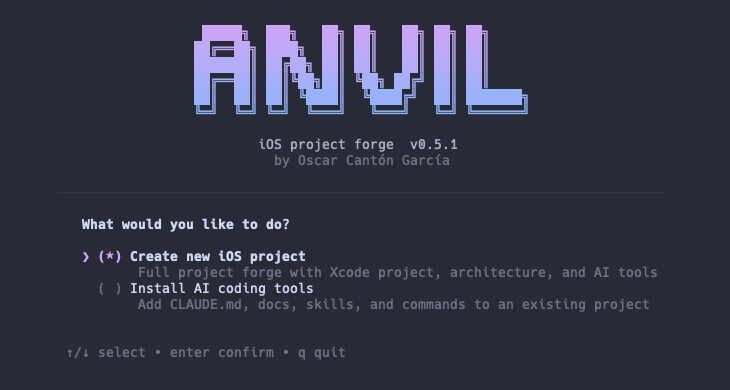
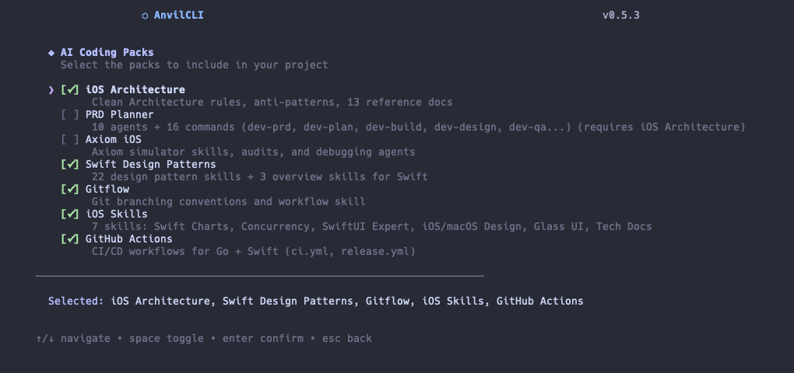
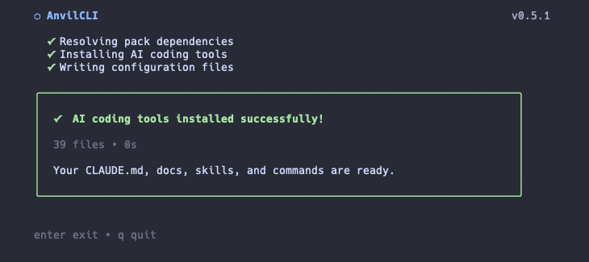

# AnvilCLI



[](https://github.com/magnoscg/anvil/releases)
[](https://developer.apple.com/ios/)
[](https://swift.org)
[](LICENSE)

CLI tool that scaffolds new iOS projects following **Clean Architecture + MVVM + Router**. Written in Go with a BubbleTea TUI wizard. Generates production-ready Xcode projects with all layers wired up and ready to build.

> **Requirements:** macOS with Xcode (the generated projects are Xcode projects). Go 1.26+ only if you install from source.

## Quick Start

### Install with Go (recommended)

```bash
go install github.com/magnoscg/anvil/cmd/anvil@latest
```

The binary lands in `$(go env GOPATH)/bin` — make sure that's on your `PATH`.

### Download a prebuilt binary

```bash
# Download the latest release
gh release download --repo magnoscg/anvil --pattern "anvil_*_darwin_arm64.tar.gz"

# Extract and install to /usr/local/bin
tar xzf anvil_*_darwin_arm64.tar.gz
./install.sh
```

> For Intel Macs, replace `arm64` with `amd64`.

### Build from source

```bash
git clone https://github.com/magnoscg/anvil.git
cd anvil
make build
# Binary at ./bin/anvil
```

## Example Project

The `Example/` folder contains a fully functional iOS project that demonstrates the architecture AnvilCLI generates. Open it directly in Xcode:

```bash
open Example/Arquitectura.xcodeproj
```

Select the `Arquitectura-Dev` scheme and run on a simulator. The example includes:

- **Architecture** feature — list + detail screens
- **Pokemon** feature — list + detail screens with API integration

Each feature follows the full Clean Architecture stack: Domain (Models, UseCases), Data (Repositories, DataSources, DTOs, Mappers), and Features (Views, ViewModels, Routers, Factories).

## Create Your Own Project

```bash
# Scaffold a new project with interactive TUI wizard
anvil init

# Add a feature to an existing project
anvil feature Auth
```

`anvil init` launches a TUI wizard that guides you through project name, bundle ID, iOS version, optional features (SwiftData, example feature), and generates a complete Xcode project with all layers.

`anvil feature` scaffolds all files for a new feature across Domain, Data, and Features layers, including tests and mocks. Must be run inside a project created with `anvil init`.

## AI packs

The wizard can drop optional "AI packs" into the generated project — conventions, skills and agent definitions for Claude Code and OpenCode:



Picking packs on an existing project writes them straight into it:



| Pack | Contents |
|------|----------|
| `ios-architecture` | Clean Architecture rules, anti-patterns, 13 reference docs |
| `prd-planner` | 10 agents + 16 commands (dev-prd, dev-plan, dev-build, dev-qa…) |
| `axiom-ios` | Wiring for the Axiom simulator skills, audits and debugging agents |
| `swift-design-patterns` | 22 design pattern skills + 3 overview skills |
| `ios-skills` | 7 skills: Swift Charts, Concurrency, SwiftUI Expert, Glass UI, Tech Docs |
| `gitflow` | Git branching conventions and workflow skill |
| `github-actions` | CI/CD workflows for Go + Swift |

Pack installation is collision-safe: Anvil renders and validates the complete
plan before writing, reports every conflict together, and never overwrites
skills, commands, workflows, docs, or `CLAUDE.md`. Existing
`.claude/settings.json` values take precedence; compatible additions are merged
and published atomically while preserving file permissions.

The 34 bundled skills are tracked in
[`templates/ai-packs/PROVENANCE.yml`](templates/ai-packs/PROVENANCE.yml). Original
Anvil content is MIT-licensed and attributed to Oscar Canton. The three
unmodified third-party MIT skills are pinned to exact commits and included in
[`THIRD_PARTY_NOTICES.md`](THIRD_PARTY_NOTICES.md); selecting their pack also
installs the required notices into the generated project.

### Third-party prerequisites

Some packs configure the project to use tools that are **not bundled here** and must be installed separately:

- **[Axiom](https://github.com/CharlesWiltgen/Axiom)** by Charles Wiltgen (MIT) — the `axiom-ios` pack writes conventions for its skills and agents, but ships none of its code. Install it with:
  ```bash
  claude plugin marketplace add CharlesWiltgen/Axiom
  claude plugin install axiom@axiom-marketplace
  ```
- **sosumi MCP** — referenced by `axiom-ios` for Apple documentation lookups.
- **ui-ux-pro-max** — referenced by the `prd-planner` design agent.

Packs that reference a missing tool still generate fine; those particular commands simply won't resolve.

## Development

### Build

```bash
make build
```

### Run tests

```bash
# Unit tests
make test

# Skill inventory, provenance, and 25 standalone Swift 6 examples
./scripts/validate-skill-content.sh

# Integration tests (requires Xcode)
make test-integration
```

### Format and lint

```bash
make fmt
make lint
```

### Full pipeline

```bash
make all    # fmt + lint + test + build
```

### Golden file tests

Golden files in `testdata/golden/` capture expected template output. To regenerate them after template changes:

```bash
go test ./internal/generator/ -run TestGolden -update
```

## Architecture

AnvilCLI is organized as a standard Go project:

```
cmd/anvil/       CLI entry point (Cobra commands)
internal/
  config/           Data models, configuration, naming utilities
  deps/             System dependency detection
  generator/        Template rendering, file writing, project generation
  feature/          Feature scaffolding logic
  tui/              BubbleTea TUI screens
templates/          Go text/template files (embedded via go:embed)
  base/             Always included (App/, Core/, Domain/)
  swiftdata/        Optional SwiftData persistence stack
  ai-packs/         Optional AI coding packs (Claude Code / OpenCode)
  example/          Optional example feature
  feature/          Feature scaffold templates
```

## Generated Project Structure

```
<ProjectName>/
  <ProjectName>/
    App/
      Application/          @main app entry point
      Config/               Environment, AppDependencies, Xcconfig/
      Navigation/           AppRouter, RootNavigationView
    Core/
      Common/               Extensions, Models, SwiftUI helpers
      DesignSystem/         Colors, Typography, Spacing tokens
      Networking/           APIClient, Endpoints, Interceptors
      Security/             KeychainHelper
    Domain/
      Common/               DomainError
      <Feature>/            Models/, UseCases/
    Data/
      <Feature>/            Repositories/, DataSources/, DTO/, Mappers/
    Features/
      <Feature>/
        DI/                 Factory
        UI/                 View, State, Decorator, Components/
        Presentation/       ViewModels/, Mappers/
        Navigation/         Router (+ optional RouteResolver)
    Resources/              Assets, Localizable strings
  <ProjectName>Tests/       Unit tests mirroring source structure
  <ProjectName>.xcodeproj/  Native Xcode project (generated by CLI)
  .anvil.yml                AnvilCLI project marker
```

## Contributing

1. Fork and create a feature branch from `develop`
2. Make changes and add tests
3. Run `make all` to verify everything passes
4. Open a PR against `develop`

### Adding or modifying templates

- Templates live in `templates/` and use Go `text/template` syntax
- All templates are embedded into the binary via `go:embed`
- After changing templates, run `go test ./internal/generator/ -run TestGolden -update` to update golden files
- Verify with `make test`

## License

[MIT](LICENSE) © Oscar Canton
