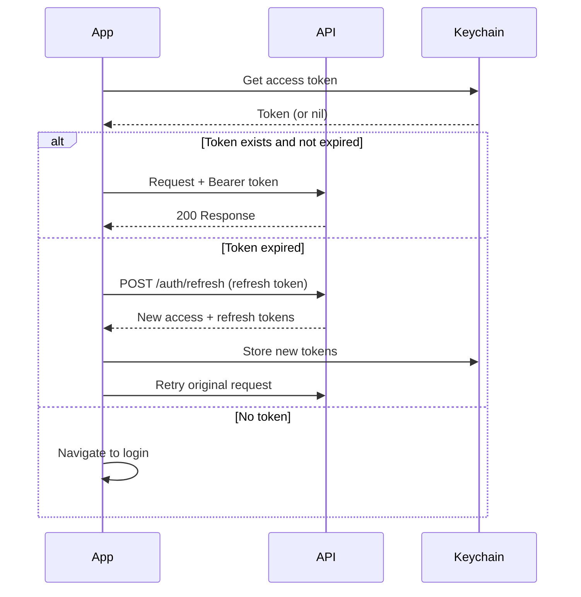

# API Documentation Template

Use this template when the user asks to document: API layer, networking, service layer, endpoints, request/response models, or backend integration.

---

## Template Structure

```markdown
# [Project Name] - API Documentation

{toc}

## 1. Overview

Description of the API layer architecture, base URL strategy, and authentication mechanism.

### Base Configuration

| Environment | Base URL | Auth |
|-------------|----------|------|
| Production | `https://api.example.com/v1` | Bearer Token |
| Staging | `https://staging-api.example.com/v1` | Bearer Token |
| Development | `https://dev-api.example.com/v1` | Bearer Token |

### Authentication
Describe the auth flow: OAuth2, JWT, API Key, etc.

```swift
// Token management
protocol AuthTokenProvider {
    func accessToken() async throws -> String
    func refreshToken() async throws -> String
}
```

### API Versioning Strategy

| Aspect | Approach |
|--------|----------|
| Versioning | [URL path (`/v1/`) / Header (`Accept-Version`) / Query param] |
| Current Version | `v1` |
| Deprecation Policy | Minimum 6 months notice, sunset header in responses |
| Migration Guide | [Link to API migration docs] |

### Authentication Flow Detail



### Certificate Pinning

| Aspect | Configuration |
|--------|--------------|
| Enabled | [Yes / No] |
| Pinning Method | [Public key / Certificate] |
| Pinned Domains | `api.example.com`, `auth.example.com` |
| Backup Pins | [Yes — backup key hash included] |
| Failure Behavior | Block request, show error, log to analytics |

```swift
// URLSession delegate for certificate pinning
class PinningDelegate: NSObject, URLSessionDelegate {
    func urlSession(_ session: URLSession, didReceive challenge: URLAuthenticationChallenge) async
        -> (URLSession.AuthChallengeDisposition, URLCredential?) {
        // Pin validation logic
    }
}
```

## 2. API Client Architecture

### 2.1 Client Setup

```swift
protocol APIClient {
    func request<T: Decodable>(_ endpoint: Endpoint) async throws -> T
}

struct Endpoint {
    let path: String
    let method: HTTPMethod
    let headers: [String: String]?
    let queryItems: [URLQueryItem]?
    let body: Encodable?
}
```

### 2.2 Error Handling

```swift
enum APIError: Error {
    case invalidURL
    case unauthorized          // 401
    case forbidden             // 403
    case notFound              // 404
    case serverError(Int)      // 5xx
    case decodingError(Error)
    case networkError(Error)
    case unknown
}
```

### 2.3 Interceptors / Middleware
Describe request/response interceptors: auth token injection, logging, retry logic.

### 2.4 Rate Limiting & Retry Strategy
Document any retry policies, exponential backoff, or rate limit handling.

### 2.5 Request Deduplication

```swift
// Prevent duplicate in-flight requests for the same resource
actor RequestDeduplicator {
    private var inFlight: [String: Task<Any, Error>] = [:]

    func deduplicate<T: Sendable>(key: String, work: @Sendable () async throws -> T) async throws -> T {
        if let existing = inFlight[key] {
            return try await existing.value as! T
        }
        let task = Task<Any, Error> { try await work() as Any }
        inFlight[key] = task
        defer { inFlight[key] = nil }
        return try await task.value as! T
    }
}
```

### 2.6 Timeout Configuration

| Endpoint Type | Timeout | Rationale |
|---------------|---------|-----------|
| Standard API calls | 30 seconds | Default for most endpoints |
| File uploads | 120 seconds | Large payloads need more time |
| File downloads | 300 seconds | Large files, variable network |
| Health check | 5 seconds | Quick connectivity check |
| WebSocket ping | 10 seconds | Keep-alive interval |

### 2.7 Request/Response Compression

| Direction | Compression | Header |
|-----------|-------------|--------|
| Request body | gzip (if >1KB) | `Content-Encoding: gzip` |
| Response body | gzip (server-controlled) | `Accept-Encoding: gzip` |

## 3. Endpoints by Domain

### 3.1 [Domain: Authentication]

#### POST `/auth/login`

**Description:** Authenticate user with email and password.

**Request:**
```swift
struct LoginRequest: Encodable {
    let email: String
    let password: String
}
```

```json
{
  "email": "user@example.com",
  "password": "secret123"
}
```

**Response (200):**
```swift
struct AuthResponse: Decodable {
    let accessToken: String
    let refreshToken: String
    let expiresIn: Int
    let user: UserDTO
}
```

```json
{
  "access_token": "eyJhbG...",
  "refresh_token": "dGhpcyBp...",
  "expires_in": 3600,
  "user": { "id": "uuid", "email": "user@example.com" }
}
```

**Error Responses:**

| Status | Error Code | Description |
|--------|-----------|-------------|
| 400 | `invalid_request` | Missing required fields |
| 401 | `invalid_credentials` | Wrong email or password |
| 423 | `account_locked` | Too many failed attempts |
| 500 | `server_error` | Internal server error |

---

### 3.2 [Domain: Next Domain]

_(Repeat the endpoint pattern for each domain/resource)_

## 4. Data Models

### 4.1 DTO → Domain Mapping

| DTO | Domain Entity | Mapper |
|-----|--------------|--------|
| `UserDTO` | `User` | `UserDTO.toDomain()` |
| `ProductDTO` | `Product` | `ProductMapper.map(_:)` |

### 4.2 Coding Strategy

```swift
// JSON decoding configuration
let decoder = JSONDecoder()
decoder.keyDecodingStrategy = .convertFromSnakeCase
decoder.dateDecodingStrategy = .iso8601
```

> ⚠️ **Warning:** Always use `convertFromSnakeCase` — the API uses snake_case while Swift models use camelCase.

## 5. Pagination

Describe the pagination strategy used by the API:

```swift
struct PaginatedResponse<T: Decodable>: Decodable {
    let data: [T]
    let pagination: PaginationInfo
}

struct PaginationInfo: Decodable {
    let currentPage: Int
    let totalPages: Int
    let totalItems: Int
    let hasNextPage: Bool
}
```

## 6. WebSocket / Real-time (if applicable)

Document any WebSocket connections, SSE streams, or push notification integrations.

## 7. Caching Strategy

| Endpoint | Cache Policy | TTL | Storage |
|----------|-------------|-----|---------|
| `/users/me` | Cache-first | 5 min | Memory |
| `/products` | Network-first | 1 hour | Disk |
| `/config` | Cache-only-offline | 24 hours | UserDefaults |

## 8. Batch Endpoints

| Endpoint | Purpose | Max Items |
|----------|---------|-----------|
| `POST /batch/items` | Fetch multiple items by IDs | 50 |
| `POST /batch/users` | Fetch multiple user profiles | 20 |

```swift
// Batch request pattern
struct BatchRequest<T: Encodable>: Encodable {
    let ids: [String]
}

// Usage: reduce N+1 API calls
func fetchItems(ids: [String]) async throws -> [Item] {
    let chunks = ids.chunked(into: 50) // respect max batch size
    return try await withThrowingTaskGroup(of: [Item].self) { group in
        for chunk in chunks {
            group.addTask {
                try await apiClient.request(.batchItems(ids: chunk))
            }
        }
        return try await group.reduce(into: []) { $0 += $1 }
    }
}
```

## 9. API Monitoring & Metrics

| Metric | Tool | Alert Threshold |
|--------|------|----------------|
| Response time (P50) | [Monitoring tool] | >500ms |
| Response time (P95) | [Monitoring tool] | >3s |
| Error rate (4xx) | [Monitoring tool] | >5% |
| Error rate (5xx) | [Monitoring tool] | >1% |
| Request volume | [Monitoring tool] | Spike >200% baseline |

### Client-Side Logging

```swift
// Log API metrics for performance monitoring
struct APIMetric {
    let endpoint: String
    let method: String
    let statusCode: Int
    let duration: TimeInterval
    let requestSize: Int
    let responseSize: Int
}
```

## 10. Testing

### Mock Server / Stub Configuration
How to run tests against mocked API responses.

```swift
struct MockAPIClient: APIClient {
    var responses: [String: Any] = [:]
    
    func request<T: Decodable>(_ endpoint: Endpoint) async throws -> T {
        guard let response = responses[endpoint.path] as? T else {
            throw APIError.notFound
        }
        return response
    }
}
```

### Network Debugging Tools
- Proxyman / Charles configuration
- Request/response logging setup

---
**Document Metadata**
| Field | Value |
|-------|-------|
| Author | [Name/Team] |
| Owner | [Name/Team] |
| Created | [Date] |
| Last Updated | [Date] |
| Last Verified | [Date] |
| Review Schedule | [Quarterly / Monthly / Per Release] |
| Status | Draft |
| Confluence Labels | `ios`, `swift`, `api`, `networking`, `[project-name]` |
```

## Writing Guidelines

- Document every endpoint the app consumes, even if obvious
- Always include both Swift types AND raw JSON examples
- Document error responses as thoroughly as success responses
- Keep the CodingStrategy section updated — this is a common source of bugs
- Include cURL examples for quick testing if possible
