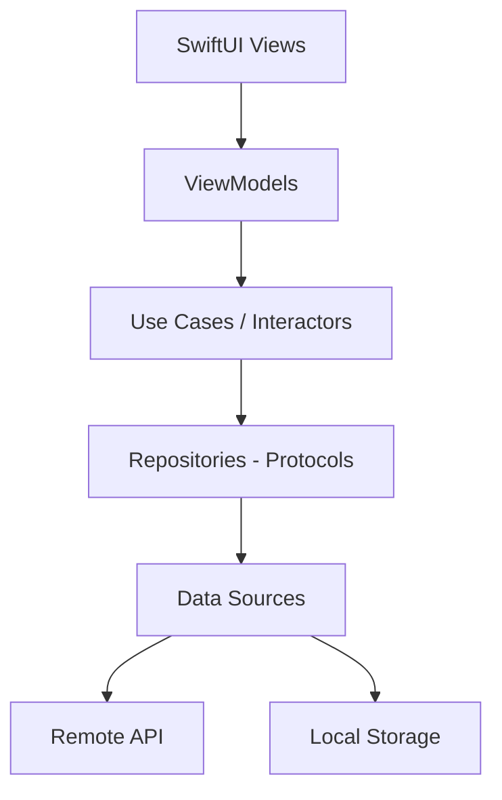
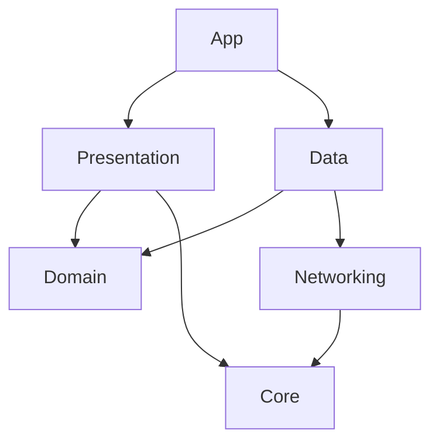

# Architecture Document Template

Use this template when the user asks for: architecture overview, system design, project structure, technical architecture, or high-level design documentation.

---

## Template Structure

```markdown
# [Project Name] - Architecture Overview

{toc}

## 1. Introduction

### 1.1 Purpose
Brief description of what this app does and the business problem it solves.

### 1.2 Scope
What this document covers and what it does not.

### 1.3 Target Audience
Who should read this document (new developers, architects, stakeholders).

### 1.4 Tech Stack Summary

| Component | Technology | Version |
|-----------|-----------|---------|
| Language | Swift | 6.x |
| UI Framework | SwiftUI | iOS 17+ |
| Architecture | Clean Architecture + MVVM | - |
| Concurrency | Swift Concurrency (async/await) | - |
| Dependency Injection | [Strategy] | - |
| Networking | URLSession / [Library] | - |
| Persistence | SwiftData / Core Data / [Other] | - |
| Testing | Swift Testing + XCTest | - |
| CI/CD | [Platform] | - |

## 2. Architecture Overview

### 2.1 Architecture Pattern
Describe the chosen architecture pattern and why it was selected.

> ℹ️ **Pattern:** Clean Architecture with MVVM presentation layer.
> Separation of concerns: UI → Presentation → Domain → Data

### 2.2 High-Level Diagram



Text fallback:
```
┌─────────────────────────────────────────────┐
│                Presentation                  │
│  ┌──────────┐    ┌─────────────────────┐    │
│  │  Views   │───▶│    ViewModels       │    │
│  │ (SwiftUI)│    │ (@Observable)       │    │
│  └──────────┘    └──────────┬──────────┘    │
├──────────────────────────────┼───────────────┤
│                Domain        │               │
│              ┌───────────────▼──────────┐    │
│              │     Use Cases            │    │
│              │  (Business Logic)        │    │
│              └───────────────┬──────────┘    │
│              ┌───────────────▼──────────┐    │
│              │  Repository Protocols    │    │
│              └───────────────┬──────────┘    │
├──────────────────────────────┼───────────────┤
│                Data          │               │
│              ┌───────────────▼──────────┐    │
│              │  Repository Impls        │    │
│              └──────┬──────────┬────────┘    │
│              ┌──────▼───┐ ┌───▼────────┐    │
│              │ Remote   │ │   Local     │    │
│              │ DataSrc  │ │  DataSrc    │    │
│              └──────────┘ └────────────┘    │
└─────────────────────────────────────────────┘
```

### 2.3 Dependency Rule
Describe the dependency direction. Inner layers never depend on outer layers. Dependencies point inward.

## 3. Module Structure

### 3.1 Package/Module Map

| Module | Type | Responsibility | Dependencies |
|--------|------|---------------|-------------|
| `App` | Application | App entry point, DI setup, navigation root | All modules |
| `Domain` | Swift Package | Entities, Use Cases, Repository protocols | None (pure Swift) |
| `Data` | Swift Package | Repository implementations, DTOs, mappers | Domain |
| `Presentation` | Swift Package | Views, ViewModels, UI components | Domain |
| `Core` | Swift Package | Extensions, utilities, shared protocols | None |
| `Networking` | Swift Package | API client, request/response handling | Core |

### 3.2 Module Dependency Diagram



## 4. Key Architectural Decisions

Link to relevant ADRs:
- [ADR-001: Choice of Clean Architecture](./adr-001)
- [ADR-002: SwiftUI vs UIKit](./adr-002)
- [ADR-003: Navigation Strategy](./adr-003)

## 5. Navigation Architecture

Describe the navigation approach (Coordinator, Router, NavigationStack, etc.):
- Navigation container strategy
- Deep linking support
- Tab/modal management

## 6. Data Flow

### 6.1 Network Request Lifecycle
Describe a typical request from UI tap to data display.

### 6.2 State Management
How state is managed across the app (@Observable, @State, stores, etc.).

### 6.3 Error Handling Strategy
How errors propagate from data layer to UI. Error types, mapping, user-facing messages.

## 7. Dependency Injection

Describe the DI approach:
- Container/resolver setup
- Registration strategy (protocol → implementation)
- Scoping (singleton, transient, per-screen)

## 8. Swift 6 Concurrency Architecture

### 8.1 Actor Isolation Model

| Layer | Isolation | Rationale |
|-------|-----------|-----------|
| Views | `@MainActor` (implicit) | SwiftUI requires main thread |
| ViewModels | `@MainActor` (explicit) | UI state must update on main |
| Use Cases | Nonisolated | Domain logic is actor-agnostic |
| Repositories | Nonisolated | Data layer runs on cooperative pool |
| Data Sources | Nonisolated | Network/DB operations are async |
| Actors (caches, stores) | Custom actor | Protect mutable shared state |

### 8.2 Sendable Boundaries

```swift
// All types crossing actor isolation boundaries must be Sendable
// Domain entities: value types → naturally Sendable
struct Product: Sendable, Identifiable { ... }

// Repository protocols: cross boundary → require Sendable
protocol ProductRepository: Sendable {
    func fetchProducts() async throws -> [Product]
}

// Mutable shared state: use actors
actor ImageCache {
    private var cache: [URL: Data] = [:]
    func get(_ url: URL) -> Data? { cache[url] }
    func set(_ url: URL, data: Data) { cache[url] = data }
}
```

### 8.3 Migration Status

> ℹ️ **Info:** See [Swift Concurrency](./13-Swift-Concurrency.md) for full module-by-module migration progress.

## 9. State Management

### 9.1 State Management Pattern

| Aspect | Choice | Justification |
|--------|--------|---------------|
| Pattern | [@Observable / TCA / Combine] | [Rationale for choice] |
| ViewModels | `@MainActor @Observable` | Simple, SwiftUI-native, no boilerplate |
| Local View State | `@State` | Ephemeral UI state (toggles, text input) |
| Shared Services | `@Environment` | DI for cross-cutting concerns |
| Persistent State | `@AppStorage` / SwiftData `@Query` | Settings / structured data |

### 9.2 State Ownership Rules

1. **ViewModels own business state** — Views only read and dispatch actions
2. **State is value types** — Structs, enums, arrays (never mutable classes)
3. **Derived state uses computed properties** — No duplicated state
4. **Each state has a single owner** — No two ViewModels mutating the same data

## 10. Multi-Environment Architecture

| Environment | Scheme | Bundle ID | API URL | Config |
|-------------|--------|-----------|---------|--------|
| Development | `[App]-Dev` | `com.company.app.dev` | `dev-api.example.com` | `Dev.xcconfig` |
| Staging | `[App]-Staging` | `com.company.app.staging` | `staging-api.example.com` | `Staging.xcconfig` |
| Production | `[App]-Prod` | `com.company.app` | `api.example.com` | `Production.xcconfig` |

> ℹ️ **Info:** See [Environments](./11-Environments.md) for full xcconfig structure, secrets management, and how to switch environments.

## 11. Feature Flag Architecture

| Aspect | Approach |
|--------|----------|
| Provider | [Firebase Remote Config / LaunchDarkly / Custom / Local only] |
| Fallback | Local defaults in code (app works without remote) |
| Testing | Override via debug menu, launch arguments, or mock service |

> ℹ️ **Info:** See [Feature Flags](./15-Feature-Flags.md) for flag registry, lifecycle, and kill switch procedures.

## 12. Security Architecture

### 12.1 Data Security

| Data Type | Storage | Protection |
|-----------|---------|------------|
| Auth tokens | Keychain | `kSecAttrAccessibleAfterFirstUnlock` |
| User credentials | Keychain | Biometric + device passcode |
| User preferences | UserDefaults / `@AppStorage` | None (non-sensitive only) |
| Cached data | File system | iOS Data Protection (NSFileProtectionComplete) |
| API keys | xcconfig (git-ignored) | Build-time injection |

### 12.2 Network Security

- Certificate pinning: [Yes/No — if yes, describe implementation]
- ATS (App Transport Security): Enforced, no exceptions
- Token refresh: Automatic via interceptor before 401

### 12.3 Biometric Authentication

Describe Face ID / Touch ID integration and fallback strategies.

## 13. Error Boundary Architecture

| Layer | Error Handling Strategy |
|-------|----------------------|
| Data Sources | Throw raw errors (URLError, DecodingError) |
| Repositories | Catch, map to domain errors, add context |
| Use Cases | Propagate or transform, add business context |
| ViewModels | Catch, map to user-facing messages, update UI state |
| Views | Display error state (banner, alert, inline message) |

### Recovery Strategy

| Error Type | Recovery | UX |
|------------|----------|-----|
| Network timeout | Auto-retry (3x, exponential backoff) | Show loading → retry message |
| 401 Unauthorized | Auto-refresh token, retry once | If refresh fails → force login |
| 5xx Server Error | Show error, manual retry | "Something went wrong. Try again." |
| Offline | Fallback to cache | "Showing cached data." |
| Decoding Error | Log, don't crash | Show partial data or error state |

## 14. Accessibility Architecture

| Aspect | Approach |
|--------|----------|
| Dynamic Type | All text uses scaled fonts (system or custom) |
| VoiceOver | All screens tested for logical reading order |
| Color Contrast | WCAG AA minimum (4.5:1 text, 3:1 UI elements) |
| Reduce Motion | Animations respect `UIAccessibility.isReduceMotionEnabled` |
| Button Sizes | Minimum 44x44pt touch targets |

> ℹ️ **Info:** See [UI Design System](./08-UI-Design-System.md) for component-level accessibility patterns.

## 15. Analytics & Telemetry Architecture

### Event Categories

| Category | Examples | Purpose |
|----------|----------|---------|
| Screen Views | `screen_viewed(name:)` | Navigation analytics |
| User Actions | `button_tapped(name:)`, `item_selected(id:)` | Feature usage |
| Business Events | `purchase_completed`, `signup_finished` | Conversion tracking |
| Errors | `api_error(code:endpoint:)` | Error monitoring |
| Performance | `screen_load_time(name:duration:)` | Performance monitoring |

### Event Naming Convention

```
[category]_[action]_[subject]
```

Examples: `auth_login_succeeded`, `cart_item_added`, `profile_avatar_changed`

## 16. Offline-First Strategy (if applicable)

| Data | Strategy | Sync Behavior |
|------|----------|---------------|
| User profile | Cache-first, background refresh | Pull on launch + every 5 min |
| Content feed | Network-first, cache fallback | Show cached if offline |
| User drafts | Local-first, sync on connectivity | Push changes on reconnect |
| Images | Lazy download, disk cache | LRU eviction at 500MB |

## 17. Performance Budgets

| Metric | Budget | Measurement |
|--------|--------|-------------|
| App Launch (cold) | <2 seconds | Instruments: App Launch |
| Screen Transition | <300ms | Instruments: SwiftUI |
| API Response (P95) | <3 seconds | Network monitoring |
| Memory (typical) | <150MB | Instruments: Allocations |
| App Binary Size | <50MB (download) | App Store Connect |
| Frame Rate | 60fps (120fps ProMotion) | Instruments: Core Animation |

## 18. Hybrid SwiftUI + UIKit (if applicable)

### Coexistence Strategy

| Usage | Framework | Reason |
|-------|-----------|--------|
| New screens | SwiftUI | Default for all new development |
| Legacy screens | UIKit | Migrate incrementally per feature |
| Complex lists | UIKit (`UICollectionView`) | Performance for 1000+ items |
| Map views | UIKit (`MKMapView`) | Richer API than SwiftUI Map |
| Camera/media | UIKit | AVFoundation requires UIKit |

### Bridging Patterns

```swift
// UIKit in SwiftUI
struct LegacyMapView: UIViewRepresentable { ... }

// SwiftUI in UIKit
let hostingController = UIHostingController(rootView: NewFeatureView())
```

## 19. Build & CI/CD

- Build configurations (Debug, Release, Staging)
- Environment management
- CI pipeline overview
- Code signing and provisioning

> ℹ️ **Info:** See [CI/CD & Release](./14-CI-CD-Release.md), [Code Signing](./12-Code-Signing.md), and [Environments](./11-Environments.md) for details.

---
**Document Metadata**
| Field | Value |
|-------|-------|
| Author | [Name/Team] |
| Owner | [Tech Lead — responsible for architecture decisions] |
| Created | [Date] |
| Last Updated | [Date] |
| Last Verified | [Date] |
| Status | Draft |
| Review Schedule | Quarterly |
| Labels | `ios`, `swift`, `architecture`, `[project-name]` |
```

## Writing Guidelines

- Write in present tense ("The app uses..." not "The app will use...")
- Be specific about versions and constraints
- Include code snippets for non-obvious patterns
- Always explain **why** a decision was made, not just **what**
- Keep diagrams up to date with the actual codebase
- Reference ADRs for any significant architectural choice
- Document Swift 6 concurrency decisions (actor isolation, Sendable boundaries)
- Include the multi-environment matrix — developers need it daily
- Link to Feature Flags, Environments, Code Signing, and Swift Concurrency docs
- Include performance budgets with measurable thresholds
- Document offline strategy even if "not applicable" — state it explicitly
