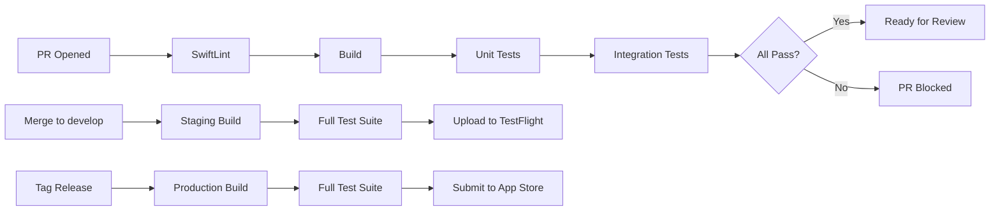

# CI/CD & Release Documentation Template

Use this template when the user asks to document: CI/CD pipeline, build configurations, release process, environments, code signing, deployment, or "how to release the app".

---

## Template Structure

```markdown
# [Project Name] - CI/CD & Release Process

{toc}

## 1. Build Configurations

### Environments

| Environment | Scheme | Config | API URL | Bundle ID Suffix |
|------------|--------|--------|---------|-----------------|
| Development | `[App] Debug` | Debug | `dev-api.example.com` | `.dev` |
| Staging | `[App] Staging` | Staging | `staging-api.example.com` | `.staging` |
| Production | `[App] Release` | Release | `api.example.com` | (none) |

### Environment Variables

| Variable | Debug | Staging | Release | Source |
|----------|-------|---------|---------|--------|
| `API_BASE_URL` | dev-api.example.com | staging-api.example.com | api.example.com | xcconfig |
| `LOG_LEVEL` | verbose | info | error | xcconfig |
| `ANALYTICS_ENABLED` | false | true | true | xcconfig |
| `FEATURE_FLAGS_URL` | dev.flags.example.com | staging.flags.example.com | flags.example.com | xcconfig |

### Configuration Files

```
Config/
├── Debug.xcconfig
├── Staging.xcconfig
├── Release.xcconfig
└── Shared.xcconfig
```

## 2. Code Signing

### Certificates & Profiles

| Type | Certificate | Profile | Managed By |
|------|-----------|---------|-----------|
| Development | Apple Development | Xcode Managed | Automatic |
| Ad Hoc (Staging) | Apple Distribution | Match AdHoc | [Fastlane Match / Manual] |
| App Store | Apple Distribution | Match AppStore | [Fastlane Match / Manual] |

### Signing Setup

```bash
# If using Fastlane Match:
fastlane match development
fastlane match adhoc
fastlane match appstore

# Certificates are stored in: [private repo / encrypted storage]
```

> ⚠️ **Certificate rotation:** Apple distribution certificates expire annually. Set a calendar reminder to renew before [date].

## 3. CI Pipeline

### Pipeline Overview



### CI Platform: [GitHub Actions / Bitrise / Jenkins / Xcode Cloud]

### PR Pipeline

```yaml
# Triggered on: PR to develop or main
steps:
  - name: Checkout
  - name: SwiftLint
    run: swiftlint lint --strict
  - name: SwiftFormat Check
    run: swiftformat --lint .
  - name: Build
    run: xcodebuild build -scheme "[App] Debug" -destination "platform=iOS Simulator,name=iPhone 16 Pro"
  - name: Unit Tests
    run: xcodebuild test -scheme "[App] Debug" -destination "platform=iOS Simulator,name=iPhone 16 Pro"
  - name: Integration Tests
    run: xcodebuild test -scheme "[App] Debug" -testPlan "IntegrationTests"
```

### Develop Pipeline (post-merge)

```yaml
# Triggered on: merge to develop
steps:
  - name: Build Staging
  - name: Run All Tests (Unit + Integration + UI)
  - name: Upload to TestFlight (Internal)
  - name: Notify #ios-builds Slack channel
```

### Release Pipeline

```yaml
# Triggered on: tag matching v*.*.*
steps:
  - name: Build Release
  - name: Run Full Test Suite
  - name: Upload to App Store Connect
  - name: Create GitHub Release with notes
  - name: Notify #releases Slack channel
```

## 4. Release Process

### 4.1 Regular Release

| Step | Action | Owner | Time |
|------|--------|-------|------|
| 1 | Feature freeze: merge all approved PRs to `develop` | iOS Lead | Day 1 |
| 2 | Create release branch: `release/X.Y.Z` | iOS Lead | Day 1 |
| 3 | Bump version number in project | Developer | Day 1 |
| 4 | QA testing on TestFlight (Staging) | QA Team | Day 1-3 |
| 5 | Fix release-critical bugs (if any) | Developers | Day 2-4 |
| 6 | Merge release branch to `main` | iOS Lead | Day 4 |
| 7 | Tag release: `vX.Y.Z` | iOS Lead | Day 4 |
| 8 | CI uploads to App Store Connect | Automated | Day 4 |
| 9 | Submit for App Store Review | iOS Lead | Day 4 |
| 10 | Merge release branch back to `develop` | iOS Lead | Day 4 |
| 11 | App Store Review | Apple | Day 4-6 |
| 12 | Release to users (manual or phased rollout) | iOS Lead | Day 5-7 |

### 4.2 Hotfix Release

| Step | Action |
|------|--------|
| 1 | Create `hotfix/JIRA-XXX-description` from `main` |
| 2 | Implement minimal fix |
| 3 | Fast-track PR (1 reviewer minimum) |
| 4 | Merge to `main` |
| 5 | Tag `vX.Y.Z+1` |
| 6 | Request expedited App Store review |
| 7 | Merge `main` back to `develop` |

> ⚠️ **Expedited review:** Apple allows requesting expedited review for critical bugs. Include clear description of user impact.

### 4.3 Version Numbering

| Component | Format | Example | When to Bump |
|-----------|--------|---------|-------------|
| Major | X.0.0 | 2.0.0 | Breaking changes, major redesign |
| Minor | 0.Y.0 | 1.3.0 | New features |
| Patch | 0.0.Z | 1.3.1 | Bug fixes, hotfixes |
| Build | auto | 142 | Every CI build (auto-increment) |

## 5. Automated Versioning

### Build Number Auto-Increment

| Approach | Tool | When |
|----------|------|------|
| CI build number | CI env variable (`$BUILD_NUMBER`) | Every CI build |
| Git commit count | `git rev-list HEAD --count` | Every build |
| agvtool | `agvtool next-version -all` | Manual or CI |
| Fastlane | `increment_build_number` | Fastlane lanes |

```bash
# In CI pipeline:
BUILD_NUMBER=${{ github.run_number }}
/usr/libexec/PlistBuddy -c "Set :CFBundleVersion $BUILD_NUMBER" Info.plist

# Or with agvtool:
agvtool new-version -all $BUILD_NUMBER
```

### Version Bumping

```bash
# Fastlane lanes for version management
lane :bump_patch do
  increment_version_number(bump_type: "patch")
  commit_version_bump
end

lane :bump_minor do
  increment_version_number(bump_type: "minor")
  commit_version_bump
end
```

## 6. Build Cache & Performance

### Cache Strategy

| Cache | Tool | Location | Invalidation |
|-------|------|----------|-------------|
| SPM packages | Built-in | `~/Library/Caches/org.swift.swiftpm` | On `Package.resolved` change |
| DerivedData | Xcode | `~/Library/Developer/Xcode/DerivedData` | On clean build |
| CI cache | [CI provider] | CI cache storage | On dependency change |
| Artifact cache | [Artifactory/S3] | Remote storage | Version-based |

### CI Build Performance

| Metric | Current | Target |
|--------|---------|--------|
| Clean build time | [Xm Ys] | <[target] |
| Incremental build time | [Xm Ys] | <[target] |
| Test suite duration | [Xm Ys] | <[target] |
| Total pipeline time | [Xm Ys] | <[target] |

### Optimization Tips

```yaml
# GitHub Actions cache example
- uses: actions/cache@v4
  with:
    path: |
      ~/Library/Caches/org.swift.swiftpm
      ~/Library/Developer/Xcode/DerivedData
    key: spm-${{ hashFiles('**/Package.resolved') }}
    restore-keys: spm-
```

## 7. App Size Monitoring

### Size Budget

| Component | Budget | Current |
|-----------|--------|---------|
| Download size (cellular) | <[X]MB | [Y]MB |
| Download size (WiFi) | <[X]MB | [Y]MB |
| Install size | <[X]MB | [Y]MB |

### Size Tracking

```bash
# Generate app size report
xcrun altool --validate-app --file App.ipa --type ios --output-format json

# Or use App Thinning Size Report
xcodebuild -exportArchive \
  -archivePath App.xcarchive \
  -exportPath export \
  -exportOptionsPlist ExportOptions.plist \
  -exportThinning "<thin-for-all-variants>"
```

### Size Regression Prevention

| Rule | Action |
|------|--------|
| New image assets | Must be optimized (WebP preferred, <100KB each) |
| New SPM dependency | Requires ADR with size impact analysis |
| Binary size increase >500KB | Requires team review |
| Asset catalog growth >1MB | Requires cleanup pass |

## 8. Dependency Update Policy

| Aspect | Policy |
|--------|--------|
| Security patches | Apply immediately, hotfix if needed |
| Minor updates | Weekly review, batch update |
| Major updates | Monthly review, ADR if breaking changes |
| New dependencies | Requires ADR + team approval |
| Dependency audit | Monthly (check for vulnerabilities, license issues) |

### Update Process

```bash
# Check for outdated packages
swift package show-dependencies --format json

# Update specific package
swift package update [PackageName]

# Update all packages
swift package update
```

## 9. TestFlight Distribution

### Groups

| Group | Access | Auto-distribute | Purpose |
|-------|--------|----------------|---------|
| Internal Team | All devs + QA | ✅ Yes | Daily builds from develop |
| Beta Testers | Selected external | ❌ Manual | Pre-release validation |
| Stakeholders | PMs, designers | ❌ Manual | Feature review |

### What's New Notes

```
# Template for TestFlight "What to Test"
Build: X.Y.Z (build-number)
Branch: develop / release/X.Y.Z

## Changes
- [Feature] Description
- [Fix] Description

## Focus Areas for Testing
- Feature X: test scenario Y
- Regression: check Z still works

## Known Issues
- Issue A (ticket link)
```

## 10. Beta Feedback Loop

### Feedback Collection

| Channel | Tool | Priority |
|---------|------|----------|
| In-app feedback | [Shake to report / Custom] | High |
| TestFlight feedback | App Store Connect | Medium |
| Slack channel | `#beta-feedback` | Medium |
| Jira tickets | Dedicated epic | Low (triaged) |

### Feedback Triage

| Severity | Response Time | Action |
|----------|---------------|--------|
| Crash / data loss | <4 hours | Hotfix or kill switch |
| Feature broken | <24 hours | Fix in next beta |
| UX issue | Next sprint | Backlog and prioritize |
| Enhancement | Sprint planning | Product decision |

## 11. Rollback Procedures

### App Store Rollback

| Scenario | Action | Time |
|----------|--------|------|
| Critical crash in production | Submit previous version for expedited review | ~24h |
| Feature regression | Use feature flag kill switch (instant) | Instant |
| API incompatibility | Deploy previous API version + app hotfix | Hours |
| Cannot rollback | Phased rollout pause + hotfix | Hours-Days |

> ⚠️ **Warning:** Apple does not support "rolling back" to a previous version. You must submit a new build with the fix or the old code.

### Phased Release Controls

```bash
# Pause phased rollout (via App Store Connect API)
# Use Fastlane or gh CLI
fastlane deliver --phased_release

# Or manually in App Store Connect:
# My Apps → App → Version → Phased Release → Pause
```

## 12. CI Secret Management

### Required Secrets

| Secret | Description | Rotation | Where Stored |
|--------|-------------|----------|-------------|
| `MATCH_PASSWORD` | Fastlane match encryption key | Annually | Team vault |
| `MATCH_GIT_URL` | Certificates repo URL | Never | CI secrets |
| `ASC_KEY_ID` | App Store Connect API key ID | Never | CI secrets |
| `ASC_PRIVATE_KEY` | App Store Connect .p8 key (base64) | Never | CI secrets |
| `SLACK_WEBHOOK_URL` | Build notifications | Never | CI secrets |
| `CODECOV_TOKEN` | Code coverage upload | Never | CI secrets |

### Secret Rotation Schedule

| Secret | Rotation Frequency | Owner | Process |
|--------|-------------------|-------|---------|
| Apple Distribution Certificate | Annually | iOS Lead | `fastlane match nuke` + recreate |
| Push Notification Certificate | Annually | iOS Lead | Apple Developer Portal |
| App Store Connect API Key | On compromise only | iOS Lead | ASC → Keys |
| CI access tokens | Annually | DevOps | CI provider settings |

## 13. Performance Benchmarking in CI

### Automated Performance Tests

```yaml
# Run performance benchmarks on release builds
- name: Performance Tests
  run: |
    xcodebuild test \
      -scheme "[App]-Performance" \
      -destination "platform=iOS Simulator,name=iPhone 16 Pro" \
      -resultBundlePath PerfResults.xcresult

# Extract and compare metrics
- name: Check Performance Regression
  run: |
    xcresulttool get --path PerfResults.xcresult --format json > metrics.json
    python scripts/check_perf_regression.py metrics.json
```

### Tracked Metrics

| Metric | Baseline | Max Regression | Measurement |
|--------|----------|----------------|-------------|
| App launch time | [Xs] | +20% | Instruments trace |
| Memory at idle | [XMB] | +10% | Allocations |
| First screen render | [Xms] | +30% | Time Profiler |
| API response (P95) | [Xs] | +50% | Network monitor |

## 14. App Store Submission Checklist

- [ ] Version number bumped
- [ ] Build number incremented
- [ ] All tests passing on CI
- [ ] QA sign-off obtained
- [ ] Screenshots updated (if UI changed)
- [ ] App Store description updated (if needed)
- [ ] What's New text prepared
- [ ] Privacy nutrition labels accurate
- [ ] Export compliance checked
- [ ] Release notes reviewed by PM

## 15. Monitoring After Release

| Metric | Tool | Alert Threshold |
|--------|------|----------------|
| Crash-free rate | [Crashlytics/Sentry] | <99.5% |
| App rating | App Store Connect | <4.0 stars new reviews |
| API error rate | [Monitoring tool] | >5% 4xx/5xx |
| App launch time | Xcode Organizer | >2 seconds |

---
**Document Metadata**
| Field | Value |
|-------|-------|
| Author | [Name/Team] |
| Owner | [Name/Team] |
| Created | [Date] |
| Last Updated | [Date] |
| Last Verified | [Date] |
| Review Schedule | [Quarterly/Monthly] |
| Status | Draft |
| Labels | `ios`, `ci-cd`, `release`, `deployment`, `[project-name]` |
```

## Writing Guidelines

- Include ACTUAL CI configuration (YAML, scripts), not just descriptions
- Document the version numbering strategy explicitly
- The release checklist should be copy-pasteable into a Jira ticket
- Include timing expectations (how long builds take, review times)
- Document certificate expiration dates and renewal process
