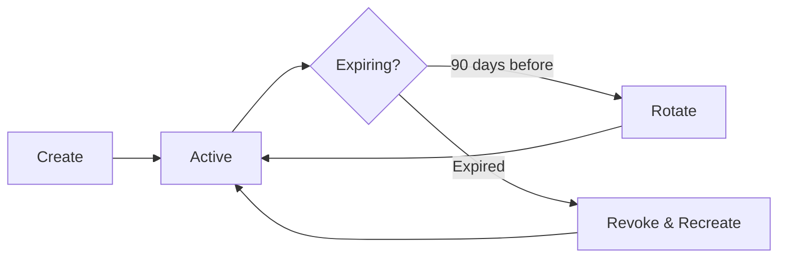

# Code Signing Document Template

Use this template when the user asks for: code signing documentation, provisioning profile management, certificate setup, fastlane match configuration, or new developer signing onboarding.

---

## Template Structure

```markdown
# [Project Name] - Code Signing

{toc}

## 1. Overview

### Signing Approach

| Aspect | Approach |
|--------|----------|
| Management | [fastlane match / manual / Xcode automatic] |
| Certificate Storage | [Private GitHub repo / S3 bucket / manual] |
| Encryption | [match encryption / manual] |
| Team | [Team Name] — Apple Developer Team ID: `[TEAM_ID]` |

> ℹ️ **Info:** We use [fastlane match / manual signing] to ensure all developers use the same certificates and provisioning profiles. This prevents "Signing broke" incidents.

## 2. Certificate Types

| Type | Purpose | Managed By | Expiry |
|------|---------|------------|--------|
| Apple Development | Local builds on physical device | fastlane match (per-developer) | 1 year |
| Apple Distribution | TestFlight & App Store submissions | fastlane match (shared) | 1 year |
| Push Notification (Sandbox) | Dev/staging push notifications | Apple Developer Portal | 1 year |
| Push Notification (Production) | Production push notifications | Apple Developer Portal | 1 year |

### Certificate Lifecycle


> ⚠️ **Warning:** Revoking a distribution certificate invalidates ALL provisioning profiles that use it. Coordinate with the team before revoking.

## 3. New Developer Setup

### Prerequisites
- [ ] Added to Apple Developer team (ask iOS Lead)
- [ ] Access to the certificates repository: `[repo-url]`
- [ ] `fastlane` installed (`brew install fastlane` or via Bundler)
- [ ] Xcode installed with command line tools

### Step-by-Step Setup

#### Step 1: Install certificates
```bash
# From the project root directory:
bundle exec fastlane match development

# When prompted:
# - Git URL: [certificates-repo-url]
# - Passphrase: [get from 1Password vault "[Vault Name]"]
```

#### Step 2: Register your device (for physical device testing)
```bash
# Get your device UDID:
# Connect device → Xcode → Window → Devices and Simulators → Copy Identifier

bundle exec fastlane match development --force_for_new_devices
```

#### Step 3: Verify in Xcode
1. Open the project in Xcode
2. Select the app target → Signing & Capabilities tab
3. Uncheck "Automatically manage signing"
4. Under "Debug", select the development profile: `match Development com.company.app[.env]`
5. Under "Release", select the distribution profile: `match AppStore com.company.app[.env]`
6. Build should succeed without signing errors

> ⏰ **Time estimate:** ~10 minutes if everything goes smoothly, ~30 minutes with troubleshooting.

## 4. Provisioning Profiles

| Profile | Type | Bundle ID | Entitlements |
|---------|------|-----------|-------------|
| match Development `com.company.app.dev` | Development | `com.company.app.dev` | Push, App Groups, Keychain |
| match Development `com.company.app` | Development | `com.company.app` | Push, App Groups, Keychain |
| match AppStore `com.company.app` | App Store | `com.company.app` | Push, App Groups, Keychain |

### Entitlements

| Entitlement | Dev | Staging | Prod |
|-------------|-----|---------|------|
| Push Notifications | ✅ (Sandbox) | ✅ (Sandbox) | ✅ (Production) |
| App Groups | ✅ `group.com.company.app.dev` | ✅ `group.com.company.app.staging` | ✅ `group.com.company.app` |
| Keychain Sharing | ✅ | ✅ | ✅ |
| Associated Domains | ❌ | ✅ | ✅ |
| Sign In with Apple | ❌ | ✅ | ✅ |

## 5. Signing Broke — Troubleshooting

| Error | Cause | Fix |
|-------|-------|-----|
| "No signing certificate found" | Certificates not installed | Run `bundle exec fastlane match development` |
| "Provisioning profile doesn't include signing certificate" | Profile/cert mismatch | Run `bundle exec fastlane match development --force` |
| "The certificate has expired" | Certificate expired | Run `bundle exec fastlane match nuke development` then `bundle exec fastlane match development` |
| "Automatic signing is unable to resolve an issue" | "Automatically manage signing" is checked | Uncheck it, select profiles manually |
| "No profiles for 'com.company.app' were found" | Profile not created for this bundle ID | Create via `bundle exec fastlane match development` with correct app identifier |
| "Code Signing Error: No certificate for team" | Wrong team selected | Verify Team ID in build settings matches your Apple Developer account |
| Xcode shows yellow warning on profile | Profile near expiry | Run match to renew |

### Nuclear Option (Last Resort)
If signing is completely broken and nothing else works:
```bash
# ⚠️ CAUTION: This deletes ALL certificates and profiles for the type
# Coordinate with team first — this affects everyone

# 1. Nuke existing certificates
bundle exec fastlane match nuke development  # or: distribution

# 2. Recreate everything
bundle exec fastlane match development
bundle exec fastlane match appstore
```

## 6. Certificate Rotation Schedule

| Task | Frequency | Responsible | How |
|------|-----------|-------------|-----|
| Check cert expiry dates | Monthly | iOS Lead | Apple Developer Portal → Certificates |
| Rotate development certs | Annually (before expiry) | iOS Lead | `fastlane match nuke development` + recreate |
| Rotate distribution certs | Annually (before expiry) | iOS Lead + Release Manager | Coordinate with TestFlight builds |
| Update push notification certs | Annually | Backend team + iOS Lead | Apple Developer Portal |
| Sync profiles after new device | On demand | Any developer | `fastlane match development --force_for_new_devices` |

## 7. CI/CD Signing

### How CI Signs Builds

The CI pipeline uses the same fastlane match setup but with environment variables:

```yaml
# GitHub Actions example:
env:
  MATCH_GIT_URL: ${{ secrets.MATCH_GIT_URL }}
  MATCH_PASSWORD: ${{ secrets.MATCH_PASSWORD }}
  MATCH_GIT_BASIC_AUTHORIZATION: ${{ secrets.MATCH_GIT_BASIC_AUTHORIZATION }}

steps:
  - name: Install certificates
    run: bundle exec fastlane match appstore --readonly
```

> ℹ️ **Info:** CI always uses `--readonly` to prevent accidentally modifying certificates.

### CI Secrets Required

| Secret | Description | Where to Find |
|--------|-------------|---------------|
| `MATCH_GIT_URL` | URL to certificates repo | Team vault |
| `MATCH_PASSWORD` | Encryption passphrase for match | Team vault |
| `MATCH_GIT_BASIC_AUTHORIZATION` | Base64-encoded git credentials | `echo -n "user:token" \| base64` |
| `ASC_KEY_ID` | App Store Connect API Key ID | App Store Connect → Keys |
| `ASC_ISSUER_ID` | App Store Connect Issuer ID | App Store Connect → Keys |
| `ASC_PRIVATE_KEY` | Base64 .p8 key content | App Store Connect → Keys (download once) |

## 8. App Store Connect Team Setup

### Team Roles

| Role | Permissions | Who |
|------|-------------|-----|
| Account Holder | Full access, legal agreements | [Person] |
| Admin | Manage users, apps, certificates | iOS Lead |
| App Manager | Submit builds, manage TestFlight | Release Manager |
| Developer | Upload builds, view analytics | All iOS developers |

### Adding a New Team Member
1. Go to [App Store Connect → Users and Access](https://appstoreconnect.apple.com/access/users)
2. Click "+" and enter their Apple ID email
3. Assign role: typically "Developer" for iOS team members
4. They accept the invitation via email
5. Add them to the Apple Developer Portal team as well (separate step)
6. Run `fastlane match` to install certificates on their machine

---
**Document Metadata**
| Field | Value |
|-------|-------|
| Author | [Name/Team] |
| Owner | [iOS Lead — responsible for certificate management] |
| Created | [Date] |
| Last Updated | [Date] |
| Last Verified | [Date] |
| Status | Draft |
| Review Schedule | Monthly (check cert expiry) |
| Labels | `ios`, `swift`, `code-signing`, `certificates`, `provisioning`, `[project-name]` |
```

## Writing Guidelines

- This document is the #1 source of onboarding pain — make every step crystal clear
- Include exact commands that can be copy-pasted
- Always mention the passphrase location (vault name, not the passphrase itself)
- Document the "nuclear option" but with clear warnings
- Include the CI signing setup so new devs understand the full picture
- Link to Environments doc for per-environment bundle ID differences
- Link to Onboarding doc from the "New Developer Setup" section
