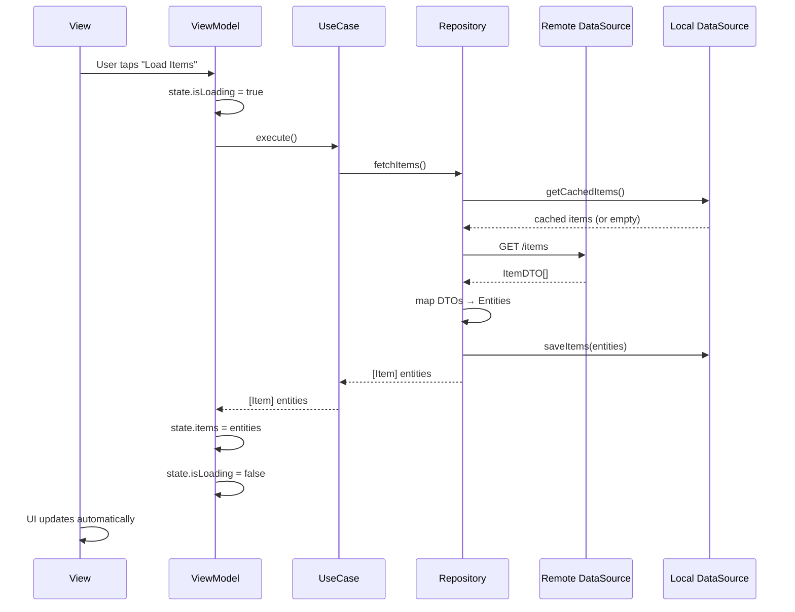
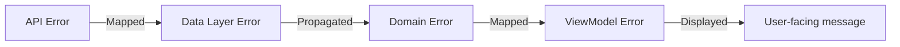

# Data Flow Documentation Template

Use this template when the user asks to document: data flow, state management, request lifecycle, error handling, reactive patterns, or "how data moves through the app".

---

## Template Structure

```markdown
# [Project Name] - Data Flow & State Management

{toc}

## 1. Overview

How data flows through the application, from user interaction to UI update.

> ℹ️ **Data flows unidirectionally:** View → ViewModel → UseCase → Repository → DataSource → (network/storage) and back.

## 2. Request Lifecycle

### 2.1 Complete Flow Example

A typical request from UI tap to data displayed:



### 2.2 Flow Description

1. **View** sends action to ViewModel (user tap, appear, pull-to-refresh)
2. **ViewModel** updates loading state, calls UseCase
3. **UseCase** orchestrates business logic, calls Repository
4. **Repository** coordinates data sources (remote + local)
5. **DataSource** performs actual I/O (network request or DB query)
6. **Response** propagates back through each layer
7. **ViewModel** updates state, View re-renders automatically

## 3. State Management

### 3.1 State Architecture

```swift
@Observable
final class FeatureViewModel {
    // MARK: - View State
    var items: [Item] = []
    var isLoading: Bool = false
    var error: FeatureError?
    var selectedFilter: Filter = .all

    // MARK: - Derived State
    var filteredItems: [Item] {
        items.filter { selectedFilter.matches($0) }
    }
    var isEmpty: Bool { items.isEmpty && !isLoading }
    var hasError: Bool { error != nil }

    // MARK: - Dependencies
    private let fetchItemsUseCase: FetchItemsUseCaseProtocol

    // MARK: - Actions
    func loadItems() async { ... }
    func refresh() async { ... }
    func selectFilter(_ filter: Filter) { ... }
}
```

### 3.2 State Patterns Used

| Pattern | Where Used | Purpose |
|---------|-----------|---------|
| `@Observable` | ViewModels | Main state container, auto-triggers view updates |
| `@State` | Views | Local, view-only state (form inputs, UI toggles) |
| `@Environment` | Views | Shared dependencies (router, theme, DI container) |
| `@Bindable` | Views | Two-way binding from @Observable to view controls |
| `@AppStorage` | Settings | UserDefaults-backed persistent preferences |

### 3.3 State Flow Rules

1. **ViewModels own the state** — Views only read and send actions
2. **State is always value types** — Use structs, enums, arrays (not classes)
3. **Derived state uses computed properties** — Never duplicate state
4. **Loading/error/empty are explicit states** — Not inferred from data

### 3.4 View State Pattern

```swift
// Common pattern for screens with async data loading
enum ViewState<T> {
    case idle
    case loading
    case loaded(T)
    case empty
    case error(Error)
}
```

## 4. Error Handling

### 4.1 Error Propagation



### 4.2 Error Types by Layer

**Data Layer:**
```swift
enum NetworkError: Error {
    case invalidURL
    case unauthorized          // 401
    case forbidden             // 403
    case notFound              // 404
    case serverError(Int)      // 5xx
    case decodingError(Error)
    case noConnection
    case timeout
}
```

**Domain Layer:**
```swift
enum FeatureError: LocalizedError {
    case loadFailed
    case unauthorized
    case offline
    case unknown(Error)

    var errorDescription: String? {
        switch self {
        case .loadFailed: "Could not load items. Please try again."
        case .unauthorized: "Your session has expired. Please log in again."
        case .offline: "No internet connection. Showing cached data."
        case .unknown: "Something went wrong."
        }
    }
}
```

### 4.3 Error Mapping Strategy

| Network Error | Domain Error | User Message |
|--------------|-------------|--------------|
| 401 Unauthorized | `.unauthorized` | "Session expired. Please log in again." |
| 404 Not Found | `.loadFailed` | "Item not found." |
| 5xx Server Error | `.loadFailed` | "Server error. Please try again later." |
| No connection | `.offline` | "No internet. Showing cached data." |
| Decoding error | `.unknown` | "Something went wrong." |

### 4.4 Error Presentation in UI

```swift
struct FeatureView: View {
    @State var viewModel: FeatureViewModel

    var body: some View {
        ContentView()
            .overlay {
                if let error = viewModel.error {
                    ErrorBanner(message: error.localizedDescription) {
                        viewModel.dismissError()
                    }
                }
            }
    }
}
```

## 5. Offline & Caching Strategy

### 5.1 Cache Policies

| Data | Strategy | TTL | Fallback |
|------|---------|-----|----------|
| User profile | Cache-first, refresh in background | 5 min | Show cached |
| Item list | Network-first | 1 hour | Show cached if offline |
| Configuration | Cache-only-offline | 24 hours | Use bundled defaults |
| Images | Disk cache | 7 days | Placeholder |

### 5.2 Offline Behavior

```swift
func fetchItems() async throws -> [Item] {
    do {
        let remote = try await remoteDataSource.fetchItems()
        localDataSource.save(remote)
        return remote
    } catch let error as NetworkError where error == .noConnection {
        // Fallback to cache when offline
        let cached = try localDataSource.getCachedItems()
        if cached.isEmpty { throw FeatureError.offline }
        return cached
    }
}
```

## 6. Reactive Patterns (if applicable)

### Combine / AsyncStream usage
Document any reactive patterns used for real-time updates, websockets, or event streams.

```swift
// Example: Observing real-time updates
func observeItems() -> AsyncStream<[Item]> {
    AsyncStream { continuation in
        // ... setup observation
    }
}
```

## 7. Concurrency & Race Conditions

### Request Deduplication

```swift
// Prevent duplicate requests for the same resource
actor RequestDeduplicator {
    private var inFlightRequests: [String: Task<Any, Error>] = [:]

    func deduplicate<T>(key: String, work: @Sendable () async throws -> T) async throws -> T {
        if let existing = inFlightRequests[key] {
            return try await existing.value as! T
        }
        let task = Task<Any, Error> { try await work() }
        inFlightRequests[key] = task
        defer { inFlightRequests[key] = nil }
        return try await task.value as! T
    }
}
```

### Cancellation Strategy

| Scenario | Cancellation Approach |
|----------|----------------------|
| Screen disappears | `.task { }` auto-cancels on view removal |
| User navigates away | ViewModel cancels in-flight tasks via stored `Task` references |
| Pull-to-refresh | Cancel previous refresh, start new one |
| Search-as-you-type | Debounce + cancel previous search task |
| Parallel fetches | `TaskGroup` auto-cancels children on first failure |

```swift
@MainActor @Observable
final class SearchViewModel {
    private var searchTask: Task<Void, Never>?

    func search(query: String) {
        searchTask?.cancel()
        searchTask = Task {
            try? await Task.sleep(for: .milliseconds(300)) // debounce
            guard !Task.isCancelled else { return }
            // perform search
        }
    }
}
```

## 8. Mutation Coordination

### Multiple Screens Updating Same Data

| Pattern | When to Use |
|---------|------------|
| Shared `@Observable` service | Few screens, simple state (e.g., cart, user session) |
| Event bus / NotificationCenter | Loosely coupled screens, rare updates |
| Repository as single source of truth | CRUD operations, cache invalidation |

### Optimistic Updates with Rollback

```swift
func toggleFavorite(item: Item) async {
    // 1. Optimistic update (immediate UI response)
    let previousState = item.isFavorite
    item.isFavorite.toggle()

    // 2. Attempt server update
    do {
        try await repository.updateFavorite(id: item.id, isFavorite: item.isFavorite)
    } catch {
        // 3. Rollback on failure
        item.isFavorite = previousState
        self.error = .updateFailed
    }
}
```

## 9. Retry & Backoff Strategy

| Strategy | Config | Use Case |
|----------|--------|----------|
| Exponential backoff | Base: 1s, Max: 30s, Jitter: ±25% | Network errors, 5xx responses |
| Fixed retry | 3 attempts, 2s delay | Idempotent operations |
| No retry | Immediate error | 4xx client errors (except 429) |
| Rate limit (429) | Respect `Retry-After` header | API rate limiting |

```swift
func withRetry<T>(
    maxAttempts: Int = 3,
    baseDelay: Duration = .seconds(1),
    operation: () async throws -> T
) async throws -> T {
    for attempt in 0..<maxAttempts {
        do {
            return try await operation()
        } catch {
            if attempt == maxAttempts - 1 { throw error }
            let jitter = Double.random(in: 0.75...1.25)
            let delay = baseDelay * pow(2, Double(attempt)) * jitter
            try await Task.sleep(for: delay)
        }
    }
    fatalError("Unreachable")
}
```

## 10. Real-Time Data

### WebSocket / Server-Sent Events

```swift
// AsyncStream for real-time updates
func observeMessages(channelId: String) -> AsyncStream<Message> {
    AsyncStream { continuation in
        let task = Task {
            for await event in webSocket.events(channel: channelId) {
                guard !Task.isCancelled else { break }
                if let message = Message(from: event) {
                    continuation.yield(message)
                }
            }
            continuation.finish()
        }
        continuation.onTermination = { _ in task.cancel() }
    }
}
```

### Push Notification Data Updates

| Notification Type | Action | UI Update |
|-------------------|--------|-----------|
| New message | Append to local cache | Refresh if on chat screen |
| Data changed | Invalidate cache | Refresh on next screen visit |
| Silent push | Background fetch | Update badge count |

## 11. Memory Pressure Handling

### Cache Eviction Strategy

| Cache | Normal | Low Memory | Background |
|-------|--------|------------|------------|
| Image cache | LRU, 200MB max | Evict to 50MB | Clear all |
| API response cache | TTL-based, 50MB max | Evict expired | Clear all |
| Computed data cache | No limit | Clear all | Clear all |

```swift
// Register for memory warnings
NotificationCenter.default.addObserver(
    forName: UIApplication.didReceiveMemoryWarningNotification,
    object: nil,
    queue: .main
) { _ in
    imageCache.evict(toSize: 50_000_000) // 50MB
    apiCache.clearExpired()
}
```

## 12. Related Documentation

- [Architecture Overview](./01-Architecture-Overview.md) — Layer definitions
- [Networking](./05-Networking.md) — API client details, retry strategies
- [Persistence](./06-Persistence.md) — Local storage details, cache management
- [Testing](./07-Testing-Strategy.md) — How to test data flows
- [Concurrency Guide](./08-Concurrency.md) — Task cancellation, race condition prevention
- [Performance](./09-Performance.md) — Memory management, cache eviction strategies
- [Real-Time Features](./10-Real-Time.md) — WebSocket integration, push notifications

---
**Document Metadata**
| Field | Value |
|-------|-------|
| Author | [Name/Team] |
| Owner | [Team/Individual] |
| Created | [Date] |
| Last Updated | [Date] |
| Last Verified | [Date] |
| Review Schedule | [Quarterly/Monthly/After major releases] |
| Status | Draft |
| Labels | `ios`, `swift`, `data-flow`, `state-management`, `concurrency`, `[project-name]` |
```

## Writing Guidelines

- The sequence diagram is the most valuable part — keep it accurate and up to date
- Document the ACTUAL error messages users see, not just error types
- Be explicit about offline behavior — this is often the most under-documented area
- Show real ViewState patterns used in the project, not theoretical ones
- Document any Combine/AsyncStream reactive patterns separately from the main request flow
