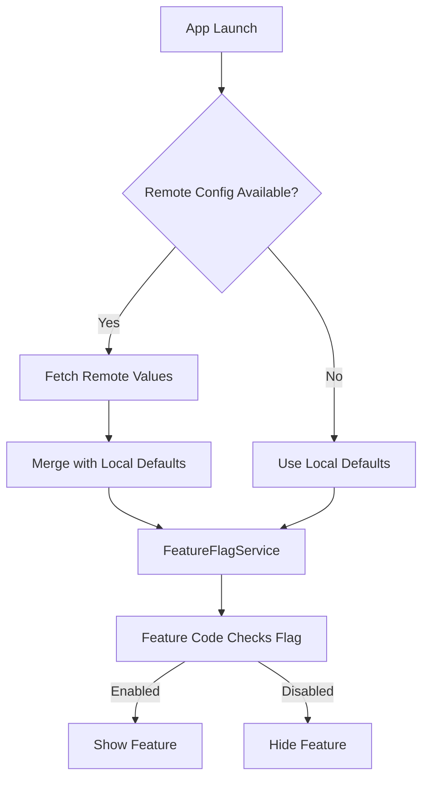
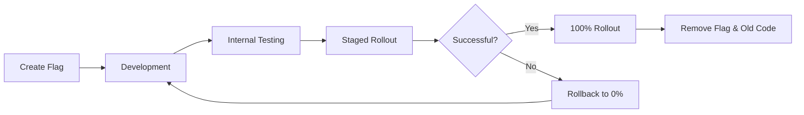

# Feature Flags Document Template

Use this template when the user asks for: feature flag documentation, feature toggle architecture, A/B testing setup, kill switch documentation, or remote configuration management.

---

## Template Structure

```markdown
# [Project Name] - Feature Flags

{toc}

## 1. Overview

### Architecture

| Aspect | Approach |
|--------|----------|
| Provider | [Firebase Remote Config / LaunchDarkly / Custom / Local only] |
| Fallback | Local defaults in code (app works without remote) |
| Refresh | [On app launch / Every N minutes / On demand] |
| Storage | [UserDefaults / In-memory / Custom cache] |
| Testing | Override via [Xcode scheme arguments / Debug menu / Unit test injection] |



## 2. Current Feature Flags

| Flag Key | Type | Default | Status | Owner | Cleanup Date |
|----------|------|---------|--------|-------|-------------|
| `new_onboarding_flow` | Bool | `false` | Rolling out (50%) | @[name] | [Date] |
| `premium_paywall_v2` | Bool | `false` | A/B testing | @[name] | [Date] |
| `api_v3_migration` | Bool | `false` | Internal testing | @[name] | [Date] |
| `max_upload_size_mb` | Int | `10` | Active config | @[name] | Permanent |
| `maintenance_mode` | Bool | `false` | Kill switch | @[name] | Permanent |

> ⚠️ **Warning:** Flags marked with a "Cleanup Date" MUST be removed after that date. Stale flags add complexity and confusion.

## 3. Flag Naming Conventions

### Format
```
[scope]_[feature_name]_[variant]
```

### Rules

| Rule | Example | Counter-example |
|------|---------|----------------|
| Use snake_case | `new_checkout_flow` | `newCheckoutFlow` |
| Start with scope | `payment_apple_pay_enabled` | `apple_pay` |
| Be descriptive | `profile_edit_inline_enabled` | `feature_1` |
| Include action for booleans | `show_tutorial_banner` | `tutorial_banner` |
| Use `_enabled` suffix for toggles | `dark_mode_enabled` | `dark_mode` |
| Use `_v2`, `_v3` for iterations | `onboarding_flow_v2` | `new_onboarding` |

### Scopes

| Scope | Purpose | Example |
|-------|---------|---------|
| `auth_` | Authentication features | `auth_biometric_enabled` |
| `payment_` | Payment flow changes | `payment_apple_pay_enabled` |
| `profile_` | Profile/settings features | `profile_edit_inline_enabled` |
| `feed_` | Feed/content features | `feed_algorithm_v3` |
| `infra_` | Infrastructure/config | `infra_api_v3_migration` |
| `experiment_` | A/B test experiments | `experiment_signup_flow_b` |
| `kill_` | Kill switches | `kill_chat_feature` |

## 4. Implementation

### FeatureFlagService

```swift
// Protocol for testability
protocol FeatureFlagService: Sendable {
    func isEnabled(_ flag: FeatureFlag) -> Bool
    func value<T>(for flag: FeatureFlag) -> T?
    func refresh() async
}

// Feature flag definition
enum FeatureFlag: String, CaseIterable, Sendable {
    // Toggles
    case newOnboardingFlow = "new_onboarding_flow"
    case premiumPaywallV2 = "premium_paywall_v2"
    case apiV3Migration = "api_v3_migration"

    // Config values
    case maxUploadSizeMB = "max_upload_size_mb"

    // Kill switches
    case maintenanceMode = "maintenance_mode"
    case killChatFeature = "kill_chat_feature"

    /// Local default value (used when remote is unavailable)
    var defaultValue: Any {
        switch self {
        case .newOnboardingFlow: false
        case .premiumPaywallV2: false
        case .apiV3Migration: false
        case .maxUploadSizeMB: 10
        case .maintenanceMode: false
        case .killChatFeature: false
        }
    }
}
```

### Usage in Views

```swift
struct ProfileView: View {
    @Environment(\.featureFlags) private var featureFlags

    var body: some View {
        VStack {
            if featureFlags.isEnabled(.premiumPaywallV2) {
                NewPaywallView()
            } else {
                LegacyPaywallView()
            }
        }
    }
}
```

### Usage in ViewModels

```swift
@MainActor @Observable
final class HomeViewModel {
    private let featureFlags: FeatureFlagService

    var showNewOnboarding: Bool {
        featureFlags.isEnabled(.newOnboardingFlow)
    }

    init(featureFlags: FeatureFlagService) {
        self.featureFlags = featureFlags
    }
}
```

## 5. Flag Lifecycle



### Lifecycle Stages

| Stage | Who | What Happens |
|-------|-----|-------------|
| **Create** | Developer | Add flag to enum, set default to `false`, add remote config |
| **Development** | Developer | Build feature behind flag, merge to main |
| **Internal Testing** | Team | Enable flag for internal TestFlight group |
| **Staged Rollout** | Product + Dev | Gradually increase % (10% → 25% → 50% → 100%) |
| **Full Rollout** | Product | Flag at 100% for all users |
| **Cleanup** | Developer | Remove flag, remove old code path, remove remote config entry |

### Cleanup Process
1. Verify flag has been at 100% for at least 2 weeks without issues
2. Remove the flag from `FeatureFlag` enum
3. Remove the conditional logic — keep only the "enabled" code path
4. Remove the old/legacy code path entirely
5. Remove the flag from remote configuration
6. Update this document (remove from "Current Feature Flags" table)
7. Create PR with title: `chore: cleanup feature flag [flag_name]`

> 🚫 **Don't:** Never leave a flag at 100% indefinitely without cleaning up. Technical debt accumulates.

## 6. Kill Switches

Kill switches are special flags that can disable features instantly in production without an app update.

### Active Kill Switches

| Kill Switch | What It Disables | Fallback Behavior |
|------------|-----------------|-------------------|
| `kill_chat_feature` | In-app chat | Shows "Coming soon" message |
| `maintenance_mode` | All API calls | Shows maintenance screen |

### How to Activate a Kill Switch
1. Go to [Remote Config Dashboard URL]
2. Set the flag to `true`
3. Publish changes
4. Users will see the change within [N minutes / next app launch]
5. Notify `#incidents` Slack channel
6. Create incident ticket

### How to Create a New Kill Switch
1. Add flag to `FeatureFlag` enum with `kill_` prefix
2. Default value must be `false` (feature ON by default)
3. Wrap the feature in a check: `if !featureFlags.isEnabled(.killChatFeature)`
4. Add to the "Active Kill Switches" table above
5. Test the kill switch in staging before shipping

## 7. Testing with Flags

### Unit Tests

```swift
@Test func showsNewPaywall_whenFlagEnabled() {
    let mockFlags = MockFeatureFlagService(overrides: [
        .premiumPaywallV2: true
    ])
    let viewModel = HomeViewModel(featureFlags: mockFlags)

    #expect(viewModel.showNewPaywall == true)
}

@Test func showsLegacyPaywall_whenFlagDisabled() {
    let mockFlags = MockFeatureFlagService(overrides: [
        .premiumPaywallV2: false
    ])
    let viewModel = HomeViewModel(featureFlags: mockFlags)

    #expect(viewModel.showNewPaywall == false)
}
```

### Debug Menu Override

```swift
// In Debug builds, allow overriding flags via launch arguments
// Xcode → Edit Scheme → Run → Arguments → Launch Arguments:
// -feature_flag_new_onboarding_flow true
// -feature_flag_premium_paywall_v2 false
```

### SwiftUI Preview Override

```swift
#Preview("New Paywall V2") {
    ProfileView()
        .environment(\.featureFlags, MockFeatureFlagService(overrides: [
            .premiumPaywallV2: true
        ]))
}
```

## 8. A/B Testing

### Experiment Structure

| Experiment | Variants | Metric | Duration | Status |
|------------|----------|--------|----------|--------|
| Signup Flow | A: Current, B: Simplified | Completion rate | 2 weeks | Running |
| Paywall | A: Monthly, B: Annual first | Conversion rate | 4 weeks | Planned |

### How to Set Up an Experiment
1. Create flag with `experiment_` prefix
2. Define variants in remote config (e.g., `"a"`, `"b"`)
3. Implement both variants behind flag check
4. Add analytics events for the metric being measured
5. Set up variant distribution in remote config (50/50 or custom split)
6. Document in the "A/B Testing" table above
7. After experiment concludes, clean up losing variant

---
**Document Metadata**
| Field | Value |
|-------|-------|
| Author | [Name/Team] |
| Owner | [Tech Lead — manages flag lifecycle] |
| Created | [Date] |
| Last Updated | [Date] |
| Last Verified | [Date] |
| Status | Draft |
| Review Schedule | Monthly (check for stale flags) |
| Labels | `ios`, `swift`, `feature-flags`, `remote-config`, `[project-name]` |
```

## Writing Guidelines

- Keep the "Current Feature Flags" table as the single source of truth for what flags exist
- Every flag must have an owner and a cleanup date (except permanent config values)
- Document kill switch procedures clearly — they may be used during incidents by non-developers
- Include real code examples showing how to check flags in Views, ViewModels, and tests
- The cleanup process is as important as the creation process — document both
- Link to CI/CD doc for how flags interact with build pipelines
- Link to Testing doc for how to test flag variants
