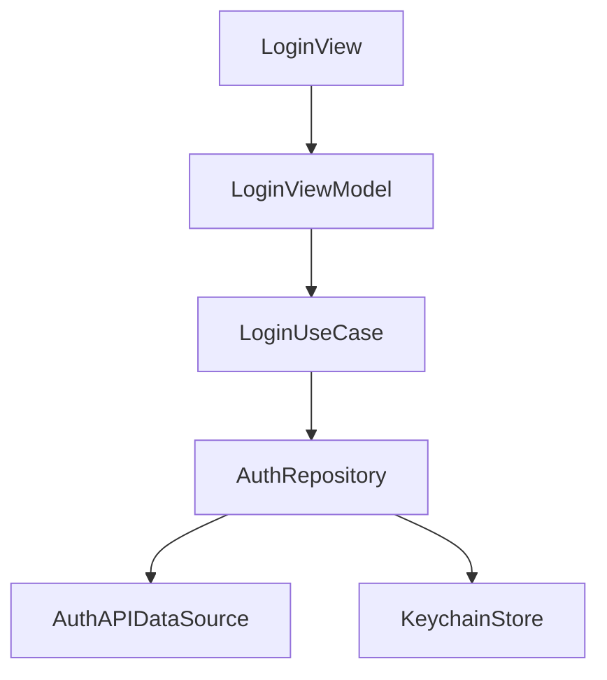
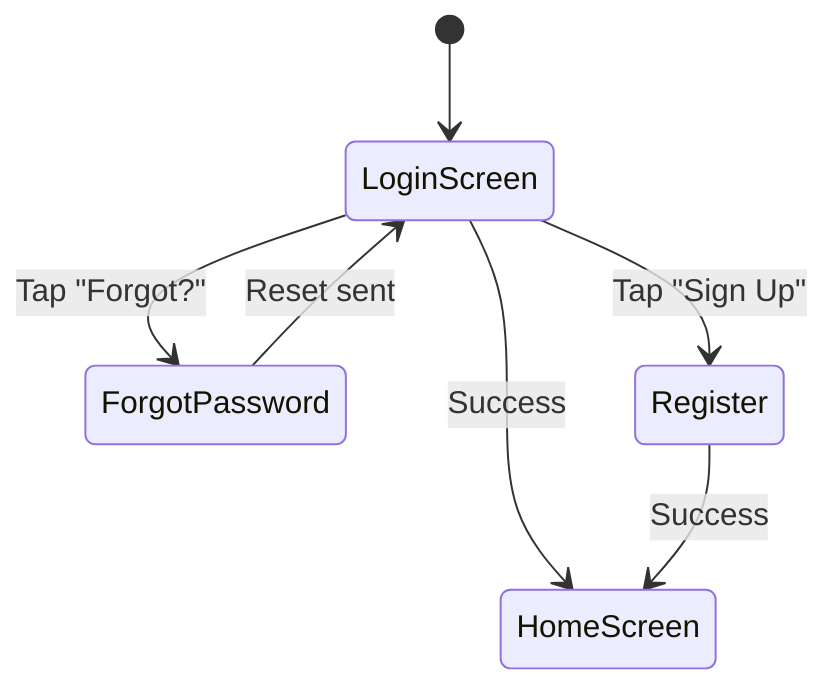

# Module Documentation Template

Use this template when the user asks to document a specific feature, module, screen, or component of the iOS app.

---

## Template Structure

```markdown
# [Module Name] Module

{toc}

## 1. Overview

**Module:** `[ModuleName]`
**Owner:** [Team/Person]
**Status:** Active / Deprecated / In Development

Brief description of what this module does, its business purpose, and how it fits into the overall application.

## 2. Module Boundaries

### What This Module Owns
- List of responsibilities and features
- Screens it manages
- Data it owns

### What This Module Does NOT Own
- Responsibilities delegated to other modules
- Shared services it depends on but doesn't manage

### Entry Points
How other modules interact with this module:

```swift
// Public interface exposed to other modules
public protocol AuthModuleInterface {
    func showLogin(from coordinator: Coordinator)
    func isUserAuthenticated() -> Bool
    func currentUser() -> User?
}
```

## 3. Architecture

### 3.1 Component Diagram



### 3.2 Key Types

| Type | Layer | Responsibility |
|------|-------|---------------|
| `LoginView` | Presentation | Login form UI |
| `LoginViewModel` | Presentation | Login logic, form validation, state |
| `LoginUseCase` | Domain | Orchestrates auth flow |
| `AuthRepository` | Data | Coordinates remote + local auth data |
| `AuthAPIDataSource` | Data | Network calls to auth endpoints |
| `UserEntity` | Domain | Core user model |

### 3.3 State Management

Describe how state flows within the module:

```swift
@Observable
final class LoginViewModel {
    // MARK: - State
    var email: String = ""
    var password: String = ""
    var isLoading: Bool = false
    var error: LoginError?
    
    // MARK: - Dependencies
    private let loginUseCase: LoginUseCaseProtocol
    
    // MARK: - Actions
    func login() async { ... }
}
```

## 4. Screens & User Flows

### 4.1 Screen Inventory

| Screen | View | ViewModel | Description |
|--------|------|-----------|-------------|
| Login | `LoginView` | `LoginViewModel` | Email/password entry |
| Register | `RegisterView` | `RegisterViewModel` | New account creation |
| Forgot Password | `ForgotPasswordView` | `ForgotPasswordViewModel` | Password reset flow |

### 4.2 User Flow Diagram



### 4.3 Navigation
How this module handles internal navigation and how it exposes navigation to parent coordinators.

## 5. Data Model

### 5.1 Domain Entities

```swift
struct User: Sendable, Identifiable {
    let id: UUID
    let email: String
    let displayName: String
    let role: UserRole
}
```

### 5.2 DTOs (Data Transfer Objects)

```swift
struct UserDTO: Decodable {
    let id: String
    let email: String
    let display_name: String
    let role: String
    
    func toDomain() -> User { ... }
}
```

### 5.3 Data Mapping
Describe the mapping strategy between layers (DTO → Entity → ViewModel state).

## 6. API Endpoints

| Method | Endpoint | Request | Response | Description |
|--------|----------|---------|----------|-------------|
| POST | `/auth/login` | `LoginRequest` | `AuthResponse` | User login |
| POST | `/auth/register` | `RegisterRequest` | `AuthResponse` | Registration |
| POST | `/auth/refresh` | `RefreshRequest` | `TokenResponse` | Token refresh |

## 7. Error Handling

### Error Types
```swift
enum LoginError: LocalizedError {
    case invalidCredentials
    case networkUnavailable
    case accountLocked
    case serverError(Int)
    
    var errorDescription: String? { ... }
}
```

### Error Flow
Describe how errors propagate from data layer → use case → view model → UI.

## 8. Testing

### 8.1 Test Coverage Map

| Component | Test File | Coverage |
|-----------|----------|----------|
| `LoginViewModel` | `LoginViewModelTests` | Unit |
| `LoginUseCase` | `LoginUseCaseTests` | Unit |
| `AuthRepository` | `AuthRepositoryTests` | Integration |
| `Login Flow` | `LoginUITests` | UI/E2E |

### 8.2 Key Test Scenarios

- ✅ Successful login with valid credentials
- ✅ Error display on invalid credentials
- ✅ Loading state during network request
- ✅ Token storage after successful login
- ✅ Form validation (empty fields, invalid email)

### 8.3 Mocking Strategy

```swift
struct MockLoginUseCase: LoginUseCaseProtocol {
    var result: Result<User, LoginError> = .success(.mock)
    
    func execute(email: String, password: String) async throws -> User {
        try result.get()
    }
}
```

## 9. Known Issues & Technical Debt

| Issue | Priority | Description | Ticket |
|-------|----------|-------------|--------|
| Token refresh race condition | High | Multiple simultaneous refreshes | JIRA-123 |
| Biometric auth not implemented | Medium | Planned for v2.1 | JIRA-456 |

## 10. Module Initialization & Configuration

### Initialization Strategy

| Strategy | When to Use | Example |
|----------|------------|---------|
| Lazy (on first use) | Most modules | Feature modules loaded when user navigates |
| Eager (at launch) | Critical services | Analytics, crash reporting, auth session |
| On demand (background) | Heavy setup | Database migration, cache warming |

### Module Configuration Per Environment

```swift
struct AuthModuleConfig {
    let baseURL: URL
    let clientId: String
    let useBiometrics: Bool

    static func config(for environment: Environment) -> AuthModuleConfig {
        switch environment {
        case .development:
            AuthModuleConfig(baseURL: URL(string: "https://dev-auth.example.com")!, clientId: "dev-client", useBiometrics: false)
        case .staging:
            AuthModuleConfig(baseURL: URL(string: "https://staging-auth.example.com")!, clientId: "staging-client", useBiometrics: true)
        case .production:
            AuthModuleConfig(baseURL: URL(string: "https://auth.example.com")!, clientId: "prod-client", useBiometrics: true)
        }
    }
}
```

## 11. Inter-Module Communication

### Communication Patterns

| Pattern | When to Use | Example |
|---------|------------|---------|
| Protocol (dependency injection) | Direct dependency, compile-time safe | `AuthModuleInterface` injected into `ProfileModule` |
| Event / Notification | Loosely coupled, broadcast | `NotificationCenter.post(name: .userDidLogout)` |
| Closure / Callback | One-to-one, short-lived | `onComplete: (Result) -> Void` |
| AsyncStream | Continuous updates | Observing auth state changes |

### Module Public API Contract

```swift
// Every module exposes a single public interface protocol
public protocol AuthModuleInterface: Sendable {
    var isAuthenticated: Bool { get }
    func currentUser() async -> User?
    func showLogin() async -> LoginResult
    func logout() async throws
    var authStateChanges: AsyncStream<AuthState> { get }
}
```

> ⚠️ **Warning:** Module public APIs must remain stable. Breaking changes require an ADR and coordination with dependent modules.

## 12. Feature Flags in This Module

| Flag | Default | Purpose | Cleanup Date |
|------|---------|---------|-------------|
| `auth_biometric_enabled` | `true` | Enable biometric login | Permanent |
| `auth_social_login_v2` | `false` | New social login provider | [Date] |

## 13. Module Metrics

| Metric | Current | Target |
|--------|---------|--------|
| Source files | [N] files | - |
| Lines of code | [N] LOC | - |
| Test coverage | [X]% | >80% |
| Build time (incremental) | [N]s | <5s |
| Binary size contribution | [N]MB | <2MB |

## 14. Module Deprecation Policy

If this module is being deprecated or replaced:

| Field | Value |
|-------|-------|
| Status | Active / Deprecated / Being Replaced |
| Replacement | [New Module Name] |
| Migration Guide | [Link] |
| Removal Target | [Date / Version] |

> ℹ️ **Info:** See [ADR-XXX](./ADRs/ADR-XXX.md) for the deprecation decision and migration plan.

## 15. Related Documentation

- [Architecture Overview](./architecture)
- [API Documentation](./api-docs)
- [ADR: Authentication Strategy](./adr-auth)

---
**Document Metadata**
| Field | Value |
|-------|-------|
| Author | [Name/Team] |
| Owner | [Team/Person] |
| Created | [Date] |
| Last Updated | [Date] |
| Last Verified | [Date] |
| Review Schedule | Quarterly / Bi-annually / As needed |
| Status | Draft |
| Confluence Labels | `ios`, `swift`, `module`, `[module-name]` |
```

## Writing Guidelines

- Focus on the public interface first, then implementation details
- Include real code examples, not pseudocode
- Document the "happy path" first, then edge cases
- Keep the screen inventory and API table updated
- Link to Jira tickets for known issues and tech debt
