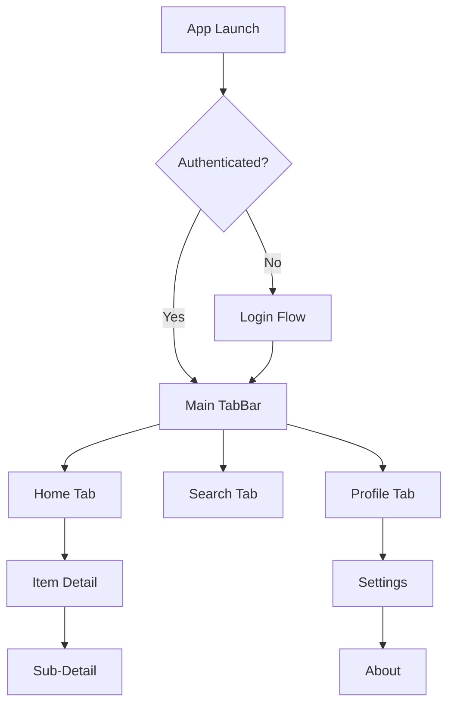

# Navigation Documentation Template

Use this template when the user asks to document: navigation, routing, coordinators, deep linking, screen flow, or "how to add a new screen".

---

## Template Structure

```markdown
# [Project Name] - Navigation Architecture

{toc}

## 1. Navigation Pattern

### Chosen Approach
Describe the navigation pattern used and link to the ADR.

> ℹ️ **Pattern:** [NavigationStack-based / Coordinator / Router / enum-driven]
> See [ADR-XXX](./ADRs/ADR-XXX-Navigation-Strategy.md) for the decision rationale.

### Why This Pattern
Brief explanation of why this approach was chosen over alternatives.

## 2. Navigation Structure

### 2.1 High-Level Flow



### 2.2 Tab Structure

| Tab | Root Screen | Nav Stack | Description |
|-----|------------|-----------|-------------|
| Home | `HomeView` | Yes | Main content feed |
| Search | `SearchView` | Yes | Discovery & search |
| Profile | `ProfileView` | Yes | User profile & settings |

### 2.3 Modal Flows

| Modal | Trigger | Presentation Style | Dismissal |
|-------|---------|-------------------|-----------|
| Login | App launch (unauthenticated) | Full screen cover | Automatic on success |
| Filter | Tap filter button | Sheet (detents: .medium, .large) | Drag or button |
| Share | Tap share button | System share sheet | System-handled |

## 3. Implementation

### 3.1 Route Definition

```swift
// All navigable destinations in the app
enum Route: Hashable {
    case home
    case itemDetail(id: String)
    case profile(userId: String)
    case settings
    case about
}
```

### 3.2 Router / Coordinator

```swift
@Observable
final class AppRouter {
    // MARK: - State
    var tabSelection: Tab = .home
    var homePath = NavigationPath()
    var searchPath = NavigationPath()
    var profilePath = NavigationPath()
    var presentedSheet: Sheet?
    var presentedFullScreenCover: FullScreenCover?

    // MARK: - Navigation Actions
    func navigate(to route: Route) { ... }
    func pop() { ... }
    func popToRoot() { ... }
    func present(sheet: Sheet) { ... }
    func dismiss() { ... }
}
```

### 3.3 NavigationStack Integration

```swift
struct HomeTabView: View {
    @Environment(AppRouter.self) var router

    var body: some View {
        @Bindable var router = router
        NavigationStack(path: $router.homePath) {
            HomeView()
                .navigationDestination(for: Route.self) { route in
                    switch route {
                    case .itemDetail(let id):
                        ItemDetailView(id: id)
                    case .settings:
                        SettingsView()
                    default:
                        EmptyView()
                    }
                }
        }
    }
}
```

## 4. Deep Linking

### 4.1 URL Scheme

| URL Pattern | Route | Example |
|------------|-------|---------|
| `myapp://home` | Home tab | `myapp://home` |
| `myapp://item/{id}` | Item detail | `myapp://item/abc-123` |
| `myapp://profile/{userId}` | Profile | `myapp://profile/user-456` |
| `myapp://settings` | Settings | `myapp://settings` |

### 4.2 Universal Links

| URL Pattern | Route |
|------------|-------|
| `https://example.com/items/{id}` | Item detail |
| `https://example.com/u/{username}` | Profile |

### 4.3 Deep Link Handling

```swift
struct ContentView: View {
    @Environment(AppRouter.self) var router

    var body: some View {
        MainTabView()
            .onOpenURL { url in
                router.handleDeepLink(url)
            }
    }
}
```

## 5. How to Add a New Screen

Step-by-step guide for adding a new navigable screen:

### Step 1: Define the route
Add a new case to the `Route` enum:
```swift
enum Route: Hashable {
    // ... existing routes
    case newFeature(id: String)  // ← Add this
}
```

### Step 2: Create the View + ViewModel
Create files in `Presentation/Screens/[NewFeature]/`:
- `NewFeatureView.swift`
- `NewFeatureViewModel.swift`

### Step 3: Register the navigation destination
Add to the relevant NavigationStack's `.navigationDestination`:
```swift
case .newFeature(let id):
    NewFeatureView(viewModel: container.makeNewFeatureViewModel(id: id))
```

### Step 4: Add deep link (if needed)
Update the deep link handler in `AppRouter`:
```swift
func handleDeepLink(_ url: URL) {
    // ... parse URL and navigate
}
```

### Step 5: Update documentation
- Update this navigation page (flow diagram + route table)
- Update the module doc if it's a new feature module

## 6. Sheet & Full Screen Cover Coordination

### Presentation Rules

| Presentation | Style | When to Use |
|-------------|-------|-------------|
| `.sheet` | Half/full sheet | Non-blocking flows (filters, settings, compose) |
| `.fullScreenCover` | Full screen | Blocking flows (login, onboarding, camera) |
| `.navigationDestination` | Push | Linear drill-down flows |
| `.alert` / `.confirmationDialog` | System dialog | Destructive actions, confirmations |

### Detent Configuration

```swift
.sheet(item: $viewModel.activeSheet) { sheet in
    NavigationStack {
        sheetContent(for: sheet)
    }
    .presentationDetents([.medium, .large])
    .presentationDragIndicator(.visible)
    .presentationBackgroundInteraction(.enabled(upThrough: .medium))
}
```

### Nested Navigation in Sheets

> ⚠️ **Warning:** Sheets with their own `NavigationStack` must manage their own `NavigationPath`. Never share a `NavigationPath` between a parent view and a sheet.

```swift
// ✅ Correct: sheet has its own NavigationStack
.sheet(isPresented: $showSettings) {
    NavigationStack {
        SettingsView()
            .navigationDestination(for: SettingsRoute.self) { route in ... }
    }
}

// 🚫 Wrong: sharing parent's NavigationPath with sheet
.sheet(isPresented: $showSettings) {
    SettingsView() // inherits parent's NavigationStack — breaks navigation
}
```

## 7. Tab Persistence & State Restoration

### Tab State Behavior

| Behavior | Implementation |
|----------|----------------|
| Tab navigation stacks persist on tab switch | Separate `NavigationPath` per tab |
| Tab selection persists across launches | `@SceneStorage("selectedTab")` |
| Deep link selects correct tab | Router sets `tabSelection` before pushing route |
| Scroll position restores | `ScrollView { ... }.scrollPosition(id: $scrollID)` |

### State Restoration After Crash

```swift
@SceneStorage("selectedTab") private var selectedTab: Tab = .home
@SceneStorage("homeScrollPosition") private var homeScrollID: String?
```

> ℹ️ **Info:** `@SceneStorage` automatically saves/restores state between app sessions. Use for tab selection, scroll positions, and form drafts.

## 8. Navigation Testing Strategies

### Unit Testing Navigation

```swift
@Test("Navigate to item detail pushes correct route")
func navigateToDetail() {
    let router = AppRouter()
    router.navigate(to: .itemDetail(id: "123"))

    #expect(router.homePath.count == 1)
}

@Test("Pop to root clears navigation stack")
func popToRoot() {
    let router = AppRouter()
    router.navigate(to: .itemDetail(id: "123"))
    router.navigate(to: .settings)
    router.popToRoot()

    #expect(router.homePath.isEmpty)
}
```

### UI Testing Navigation

```swift
func testDeepLinkOpensItemDetail() throws {
    let app = XCUIApplication()
    app.launchArguments = ["-deeplink", "myapp://item/123"]
    app.launch()

    XCTAssertTrue(app.staticTexts["Item Detail"].waitForExistence(timeout: 5))
}
```

## 9. Accessibility Navigation

### VoiceOver Navigation

| Requirement | Implementation |
|-------------|----------------|
| Tab bar labels | `.accessibilityLabel("Home Tab")` on each tab |
| Back button label | Custom: `.navigationBarBackButtonHidden(true)` + labeled button |
| Sheet dismiss | `.accessibilityAction(.escape) { dismiss() }` |
| Focus management | `@AccessibilityFocusState` for post-navigation focus |

### Rotor Support

```swift
NavigationStack {
    List {
        ForEach(sections) { section in
            Section(section.title) {
                ForEach(section.items) { item in
                    ItemRow(item: item)
                }
            }
        }
    }
    .accessibilityRotor("Sections") {
        ForEach(sections) { section in
            AccessibilityRotorEntry(section.title, id: section.id)
        }
    }
}
```

## 10. Custom Transition Animations

```swift
// Custom matched geometry transition
.navigationTransition(.zoom(sourceID: item.id, in: namespace))

// Custom push animation
extension AnyTransition {
    static var slideFromRight: AnyTransition {
        .asymmetric(
            insertion: .move(edge: .trailing),
            removal: .move(edge: .leading)
        )
    }
}
```

## 11. Dynamic Deep Linking (Target Doesn't Exist)

### Handling Missing Targets

```swift
func handleDeepLink(_ url: URL) {
    guard let route = parseRoute(from: url) else {
        // Unknown URL scheme — log and ignore
        logger.warning("Unknown deep link: \(url)")
        return
    }

    switch route {
    case .itemDetail(let id):
        // Item might not exist yet — navigate and let the screen handle loading/error
        tabSelection = .home
        homePath.append(route)

    case .profile(let userId):
        // User might be deleted — screen shows "User not found" state
        tabSelection = .profile
        profilePath.append(route)
    }
}
```

### Pre-Navigation Validation

| Strategy | When to Use |
|----------|-------------|
| Navigate then validate | Default — screen handles loading/error |
| Validate then navigate | Only for critical paths (e.g., payment) |
| Fallback route | When target is guaranteed missing (e.g., removed feature) |

## 12. Known Limitations & Workarounds

| Limitation | Workaround | Status |
|-----------|-----------|--------|
| NavigationPath doesn't support typed access | Use Route enum for type safety | Permanent |
| Sheet dismissal resets nav stack | Save path before presenting sheet | Investigating |
| Tab switching loses nav state | Separate NavigationPath per tab | Solved |
| NavigationPath not Codable with custom types | Implement custom Codable for Route enum | Permanent |
| `.navigationDestination` crashes with duplicate types | Use wrapper types or tagged enums | iOS 17 bug |
| Presentation detents don't update dynamically | Recreate sheet content on detent change | iOS 16-17 bug |
| Deep link during active modal conflicts | Dismiss modal before navigating | Permanent |

## 13. Related Documentation

- [Architecture Overview](./01-Architecture-Overview.md)
- [Project Structure](./02-Project-Structure.md)
- [ADR: Navigation Strategy](./ADRs/ADR-XXX-Navigation-Strategy.md)

---
**Document Metadata**
| Field | Value |
|-------|-------|
| Author | [Name/Team] |
| Owner | [Person/Team responsible for navigation architecture] |
| Created | [Date] |
| Last Updated | [Date] |
| Last Verified | [Date] |
| Status | Draft |
| Review Schedule | Quarterly |
| Labels | `ios`, `swift`, `navigation`, `routing`, `[project-name]` |
```

## Writing Guidelines

- Always include the "How to Add a New Screen" section — it's the most actionable
- Keep the flow diagram updated — it's the quickest way to understand the app
- Document modal presentations separately from push navigation
- Include deep linking even if not yet implemented — plan for it early
- Document known NavigationStack/SwiftUI quirks and their workarounds
- Document sheet/fullScreenCover coordination patterns — nested navigation is a common source of bugs
- Include tab persistence and state restoration — users expect this
- Document accessibility navigation (VoiceOver rotor, focus management)
- Include navigation testing strategies for both unit and UI tests
