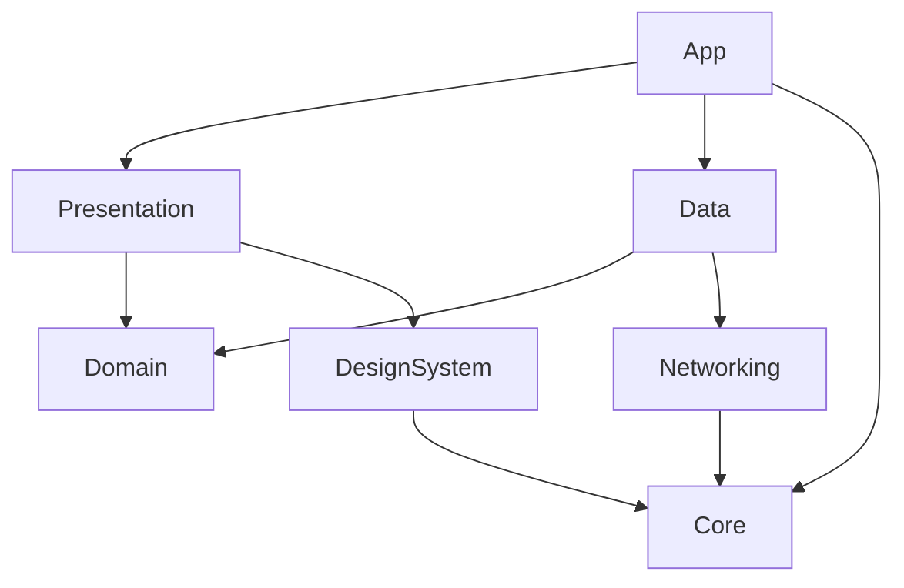

# Project Structure Documentation Template

Use this template when the user asks to document: project structure, folder organization, modules, SPM packages, module map, or "where does X go?"

---

## Template Structure

```markdown
# [Project Name] - Project Structure

{toc}

## 1. Overview

Brief description of how the project is organized, the modularization strategy, and the rationale behind it.

> ℹ️ **Modularization:** We use [SPM packages / Frameworks / Tuist / Monolith] to organize the codebase.
> See [ADR-XXX](./ADRs/ADR-XXX-Modularization-Strategy.md) for the decision rationale.

## 2. Module Map

| Module | Type | Responsibility | Dependencies |
|--------|------|---------------|-------------|
| `App` | Application target | Entry point, DI container, app-level config | All modules |
| `Domain` | SPM Package | Entities, Use Cases, Repository protocols | None (pure Swift) |
| `Data` | SPM Package | Repository implementations, DTOs, mappers | Domain |
| `Presentation` | SPM Package | Views, ViewModels, UI components | Domain |
| `Core` | SPM Package | Extensions, utilities, shared protocols | None |
| `Networking` | SPM Package | API client, request/response handling | Core |
| `DesignSystem` | SPM Package | Reusable UI components, theme, tokens | None |

## 3. Module Dependency Diagram



Text fallback:
```
App ──→ Presentation ──→ Domain ←── Data
 │          │                         │
 │          └──→ DesignSystem         └──→ Networking
 │                    │                       │
 └──→ Core ←──────────┴───────────────────────┘
```

## 4. Folder Tree

```
[ProjectName]/
├── App/                          # App entry point & configuration
│   ├── [ProjectName]App.swift    # @main entry point
│   ├── DependencyContainer.swift # DI registration
│   ├── AppConfiguration.swift    # Environment-specific config
│   └── Info.plist
│
├── Presentation/                 # UI Layer
│   ├── Screens/                  # Feature screens (one folder per feature)
│   │   ├── Home/
│   │   │   ├── HomeView.swift
│   │   │   └── HomeViewModel.swift
│   │   ├── Profile/
│   │   │   ├── ProfileView.swift
│   │   │   └── ProfileViewModel.swift
│   │   └── Settings/
│   │       ├── SettingsView.swift
│   │       └── SettingsViewModel.swift
│   ├── Components/               # Reusable UI components
│   │   ├── Buttons/
│   │   ├── Cards/
│   │   └── Inputs/
│   └── Navigation/               # Routing / coordination
│       ├── AppRouter.swift
│       └── Route.swift
│
├── Domain/                       # Business Logic Layer
│   ├── Entities/                 # Domain models (pure Swift)
│   │   ├── User.swift
│   │   └── Product.swift
│   ├── UseCases/                 # Business operations
│   │   ├── LoginUseCase.swift
│   │   └── FetchProductsUseCase.swift
│   └── Repositories/             # Repository PROTOCOLS only
│       ├── AuthRepositoryProtocol.swift
│       └── ProductRepositoryProtocol.swift
│
├── Data/                         # Data Layer
│   ├── Repositories/             # Repository IMPLEMENTATIONS
│   │   ├── AuthRepository.swift
│   │   └── ProductRepository.swift
│   ├── DataSources/              # Remote & local data access
│   │   ├── Remote/
│   │   │   ├── AuthRemoteDataSource.swift
│   │   │   └── ProductRemoteDataSource.swift
│   │   └── Local/
│   │       ├── AuthLocalDataSource.swift
│   │       └── ProductLocalDataSource.swift
│   ├── DTOs/                     # API request/response models
│   │   ├── UserDTO.swift
│   │   └── ProductDTO.swift
│   └── Mappers/                  # DTO ↔ Entity mappers
│       ├── UserMapper.swift
│       └── ProductMapper.swift
│
├── Core/                         # Shared utilities
│   ├── Extensions/
│   │   ├── String+Extensions.swift
│   │   └── Date+Extensions.swift
│   ├── Helpers/
│   │   └── Logger.swift
│   └── Constants/
│       └── AppConstants.swift
│
├── Networking/                   # Network layer
│   ├── APIClient.swift
│   ├── Endpoint.swift
│   ├── HTTPMethod.swift
│   └── Interceptors/
│       ├── AuthInterceptor.swift
│       └── LoggingInterceptor.swift
│
├── Resources/                    # Assets & static resources
│   ├── Assets.xcassets
│   ├── Localizable.xcstrings
│   └── Fonts/
│
└── Tests/
    ├── UnitTests/
    │   ├── Domain/
    │   │   └── LoginUseCaseTests.swift
    │   └── Presentation/
    │       └── HomeViewModelTests.swift
    ├── IntegrationTests/
    │   └── AuthRepositoryTests.swift
    └── UITests/
        └── LoginFlowUITests.swift
```

## 5. Where Does Each Thing Go?

Quick reference guide for developers adding new code:

| I'm creating a... | It goes in... | Naming convention |
|-------------------|--------------|-------------------|
| New screen | `Presentation/Screens/[Feature]/` | `[Feature]View.swift` + `[Feature]ViewModel.swift` |
| New domain model | `Domain/Entities/` | `[Name].swift` (struct, Sendable) |
| New use case | `Domain/UseCases/` | `[Verb][Noun]UseCase.swift` (e.g., `FetchProductsUseCase`) |
| New repository protocol | `Domain/Repositories/` | `[Name]RepositoryProtocol.swift` |
| New repository implementation | `Data/Repositories/` | `[Name]Repository.swift` |
| New API endpoint model | `Data/DTOs/` | `[Name]DTO.swift` (Codable) |
| New DTO → Entity mapper | `Data/Mappers/` | `[Name]Mapper.swift` |
| New remote data source | `Data/DataSources/Remote/` | `[Name]RemoteDataSource.swift` |
| New local data source | `Data/DataSources/Local/` | `[Name]LocalDataSource.swift` |
| New reusable UI component | `Presentation/Components/[Category]/` | `[Name]Component.swift` |
| New extension | `Core/Extensions/` | `[Type]+[Purpose].swift` |
| New API endpoint definition | `Networking/` | Add to existing `Endpoint` enum |
| New unit test | `Tests/UnitTests/[Layer]/` | `[ClassName]Tests.swift` |

## 6. Xcode Project Configuration

### Schemes

| Scheme | Configuration | Purpose |
|--------|--------------|---------|
| `[App] Debug` | Debug | Local development, simulators |
| `[App] Staging` | Staging | QA testing, TestFlight internal |
| `[App] Release` | Release | Production, App Store |

### Build Configurations

| Configuration | API URL | Logging | Optimizations |
|--------------|---------|---------|---------------|
| Debug | `dev-api.example.com` | Verbose | None |
| Staging | `staging-api.example.com` | Info | None |
| Release | `api.example.com` | Error only | Full (-O) |

### SPM Dependencies

| Package | Version | Purpose |
|---------|---------|---------|
| [Package 1] | 1.x.x | [Purpose] |
| [Package 2] | 2.x.x | [Purpose] |

> ⚠️ **When adding new dependencies:** Update this table and create an ADR if the dependency is architecturally significant.

## 7. SPM Package.swift Documentation

### Package Structure (for SPM-based projects)

```swift
// Package.swift
let package = Package(
    name: "[ProjectName]",
    platforms: [.iOS(.v17)],
    products: [
        .library(name: "Domain", targets: ["Domain"]),
        .library(name: "Data", targets: ["Data"]),
        .library(name: "Presentation", targets: ["Presentation"]),
        .library(name: "Core", targets: ["Core"]),
    ],
    dependencies: [
        // External dependencies
    ],
    targets: [
        .target(name: "Domain", dependencies: []),
        .target(name: "Data", dependencies: ["Domain", "Core"]),
        .target(name: "Presentation", dependencies: ["Domain", "Core"]),
        .target(name: "Core", dependencies: []),
        // Test targets
        .testTarget(name: "DomainTests", dependencies: ["Domain"]),
        .testTarget(name: "DataTests", dependencies: ["Data"]),
        .testTarget(name: "PresentationTests", dependencies: ["Presentation"]),
    ]
)
```

### Resource Bundles

| Module | Resources | Access |
|--------|-----------|--------|
| `Presentation` | Colors, images | `Bundle.module` |
| `DesignSystem` | Fonts, icons, theme | `Bundle.module` |
| `Core` | Localizable strings | `Bundle.module` |

```swift
// Accessing resources from SPM modules
Image("logo", bundle: .module)
Color("Primary", bundle: .module)
```

## 8. Build Phases & Code Generation

### Build Phase Scripts

| Phase | Script | Purpose | When |
|-------|--------|---------|------|
| SwiftLint | `swiftlint lint` | Lint check on build | Every build |
| SwiftFormat | `swiftformat --lint .` | Format check | CI only |
| SwiftGen | `swiftgen` | Type-safe resources | On resource change |
| Build Number | `agvtool bump` | Auto-increment build | CI release builds |

### Generated Code

| Generator | Output | Location |
|-----------|--------|----------|
| SwiftGen (Strings) | `L10n.swift` | `Generated/Strings+Generated.swift` |
| SwiftGen (Assets) | `Asset.swift` | `Generated/Assets+Generated.swift` |
| Sourcery (Mocks) | `AutoMockable.swift` | `Generated/Mocks/` |

> 🚫 **Don't:** Never edit files in `Generated/` manually. They are overwritten on every build.

## 9. Multi-Target Setup

### Targets

| Target | Type | Bundle ID | Purpose |
|--------|------|-----------|---------|
| `[App]` | Application | `com.company.app` | Main iOS app |
| `[App]Widget` | Widget Extension | `com.company.app.widget` | Home screen widgets |
| `[App]NotificationService` | Extension | `com.company.app.notification-service` | Rich push notifications |
| `[App]IntentsExtension` | Extension | `com.company.app.intents` | Siri intents |
| `[App]WatchApp` | watchOS App | `com.company.app.watchkitapp` | Apple Watch companion |

### Shared Code Between Targets

```
SharedFramework/
├── Models/           # Shared domain models
├── Networking/       # Shared API client
└── Extensions/       # Shared utilities
```

> ℹ️ **Info:** Use an App Group (`group.com.company.app`) for sharing data (UserDefaults, files) between the main app and extensions.

## 10. Test Target Organization

```
Tests/
├── UnitTests/
│   ├── Domain/                  # UseCase, Entity tests
│   ├── Presentation/            # ViewModel tests
│   └── Data/                    # Mapper, DTO tests
├── IntegrationTests/
│   ├── Repositories/            # Repository + DataSource tests
│   └── Networking/              # API client tests with stubs
├── UITests/
│   ├── Flows/                   # End-to-end user flow tests
│   └── Pages/                   # Page objects for XCUITest
├── Mocks/
│   ├── Domain/                  # MockLoginUseCase, etc.
│   ├── Data/                    # MockAuthRepository, etc.
│   └── Networking/              # MockAPIClient
├── Fixtures/
│   ├── JSON/                    # API response fixtures
│   └── Models/                  # User+Mock.swift, etc.
└── Helpers/
    ├── XCTestCase+Helpers.swift
    └── TestDependencyContainer.swift
```

## 11. Preview Assets & Resources

```
Resources/
├── Assets.xcassets/              # App icons, images
├── Preview Content/
│   ├── Preview Assets.xcassets/  # Preview-only images
│   └── SampleData.json          # Preview mock data
├── Localizable.xcstrings         # Localized strings
├── Fonts/                        # Custom fonts (.ttf, .otf)
└── [Environment]GoogleService-Info.plist
```

## 12. File Templates

If the project uses custom Xcode file templates, document where to find them and how to install:

```bash
# Install custom file templates
cp -R FileTemplates/ ~/Library/Developer/Xcode/Templates/File\ Templates/[ProjectName]/
```

Available templates:
- **Feature Module**: Creates View + ViewModel + UseCase + Tests
- **Repository**: Creates Protocol + Implementation + Mock

## 13. Build System Choice

| Aspect | Current Choice | Alternatives Considered |
|--------|---------------|------------------------|
| Build System | [Xcode / Tuist / XcodeGen / Bazel] | [Other options] |
| Dependency Manager | [SPM / CocoaPods / Carthage] | [Other options] |
| Module Strategy | [SPM local packages / Frameworks / Monolith] | [Other options] |

> ℹ️ **Info:** See [ADR-XXX](./ADRs/ADR-XXX-Build-System.md) for the rationale behind build system choices.

---
**Document Metadata**
| Field | Value |
|-------|-------|
| Author | [Name/Team] |
| Owner | [Person/Team responsible for project structure] |
| Created | [Date] |
| Last Updated | [Date] |
| Last Verified | [Date] |
| Status | Draft |
| Review Schedule | On structural changes |
| Labels | `ios`, `swift`, `structure`, `modules`, `[project-name]` |
```

## Writing Guidelines

- Update the folder tree whenever new top-level directories are added
- The "Where Does Each Thing Go?" table is the most referenced section — keep it accurate
- Include real folder names and paths, not generic placeholders
- When modules are added or removed, update the Module Map and dependency diagram
- Document any deviation from the standard structure (e.g., legacy modules)
- Include Package.swift documentation for SPM-based projects
- Document all build phases and generated code locations
- List all targets (app, widgets, extensions, watch) and their bundle IDs
- Document test organization including mocks, fixtures, and helpers
