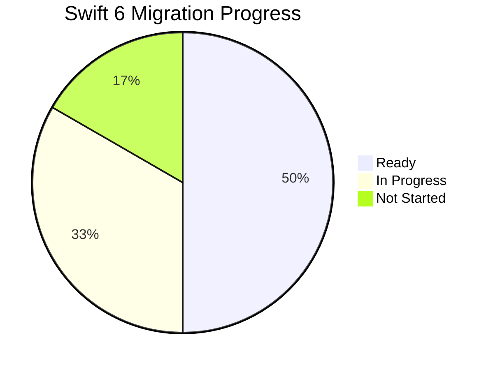

# Swift Concurrency Document Template

Use this template when the user asks for: Swift 6 concurrency documentation, strict concurrency migration status, actor isolation conventions, Sendable conformance rules, or async/await patterns documentation.

---

## Template Structure

```markdown
# [Project Name] - Swift Concurrency

{toc}

## 1. Current Status

| Property | Value |
|----------|-------|
| Swift Version | [5.x / 6.x] |
| Swift Language Mode | [5 / 6] |
| Strict Concurrency Checking | [minimal / targeted / complete] |
| Xcode Version | [version] |
| Target | All modules / [specific modules] |

> ℹ️ **Info:** Swift language mode [5/6] is configured in [Build Settings / Package.swift]. Strict concurrency checking level is set to `[complete]` which [produces warnings / produces errors] for potential data races.

## 2. Module Migration Status

| Module | Swift 6 Ready | Concurrency Warnings | Notes |
|--------|:------------:|:--------------------:|-------|
| `Domain` | ✅ | 0 | All value types, naturally Sendable |
| `Networking` | ✅ | 0 | async/await throughout |
| `Presentation` | ⚠️ | 3 | Third-party delegate callbacks pending |
| `Data` | ⚠️ | 7 | Legacy callback-based APIs |
| `Core` | ✅ | 0 | Utilities, extensions |
| `App` | ❌ | 15 | Depends on all modules |

### Migration Progress


## 3. Conventions

### 3.1 @MainActor Policy

**Rule: All ViewModels are `@MainActor`.**

```swift
// ✅ Correct: ViewModel is @MainActor
@MainActor @Observable
final class ProfileViewModel {
    var name: String = ""
    var isLoading: Bool = false

    private let fetchProfileUseCase: FetchProfileUseCase

    init(fetchProfileUseCase: FetchProfileUseCase) {
        self.fetchProfileUseCase = fetchProfileUseCase
    }

    func loadProfile() async {
        isLoading = true
        defer { isLoading = false }

        do {
            let profile = try await fetchProfileUseCase.execute()
            name = profile.name
        } catch {
            // handle error
        }
    }
}
```

```swift
// 🚫 Don't: Individual method isolation
final class ProfileViewModel {
    @MainActor var name: String = ""  // Scattered isolation

    @MainActor func loadProfile() async {  // Inconsistent
        // ...
    }
}
```

**Where @MainActor applies:**

| Type | @MainActor? | Reason |
|------|:-----------:|--------|
| ViewModels | ✅ Always | UI state must be on main actor |
| SwiftUI Views | ✅ Implicit | SwiftUI Views are already @MainActor |
| UIKit ViewControllers | ✅ Always | UIKit requires main thread |
| Use Cases | ❌ Never | Domain logic is actor-agnostic |
| Repositories | ❌ Never | Data layer runs on cooperative pool |
| Data Sources | ❌ Never | Network/DB operations are async |

### 3.2 Sendable Conformance

**Rule: All types that cross actor isolation boundaries must be `Sendable`.**

```swift
// ✅ Domain entities are value types → naturally Sendable
struct User: Sendable {
    let id: UUID
    let name: String
    let email: String
}

// ✅ Enums are naturally Sendable
enum AuthState: Sendable {
    case authenticated(User)
    case unauthenticated
    case loading
}

// ✅ Protocols that cross boundaries require Sendable
protocol AuthRepository: Sendable {
    func login(email: String, password: String) async throws -> User
    func logout() async throws
}

// ✅ Final class with let properties is Sendable
final class APIClient: Sendable {
    let baseURL: URL
    let session: URLSession

    init(baseURL: URL, session: URLSession = .shared) {
        self.baseURL = baseURL
        self.session = session
    }
}
```

```swift
// 🚫 Don't: Mutable class without isolation
class UserCache {  // Not Sendable — has mutable state
    var cachedUser: User?  // Data race risk
}

// ✅ Fix: Use actor for mutable shared state
actor UserCache {
    private var cachedUser: User?

    func get() -> User? { cachedUser }
    func set(_ user: User) { cachedUser = user }
}
```

**Sendable rules summary:**

| Type | Sendable? | How |
|------|:---------:|-----|
| Struct with all Sendable properties | ✅ Auto | Compiler infers |
| Enum with all Sendable associated values | ✅ Auto | Compiler infers |
| Final class with only `let` Sendable properties | ✅ Explicit | Add `: Sendable` |
| Class with mutable state | ❌ | Use actor or @MainActor instead |
| Actor | ✅ Always | Actors are always Sendable |
| Closure | ⚠️ | Must be `@Sendable` if crossing boundaries |

### 3.3 Structured Concurrency

**Rule: Prefer `TaskGroup` over multiple independent `Task` launches.**

```swift
// ✅ Correct: Structured concurrency with TaskGroup
func loadDashboard() async throws -> Dashboard {
    async let profile = fetchProfile()
    async let notifications = fetchNotifications()
    async let settings = fetchSettings()

    return try await Dashboard(
        profile: profile,
        notifications: notifications,
        settings: settings
    )
}

// ✅ Correct: TaskGroup for dynamic number of tasks
func loadAllCategories(ids: [CategoryID]) async throws -> [Category] {
    try await withThrowingTaskGroup(of: Category.self) { group in
        for id in ids {
            group.addTask {
                try await self.fetchCategory(id: id)
            }
        }
        return try await group.reduce(into: []) { $0.append($1) }
    }
}
```

```swift
// 🚫 Don't: Unstructured Task.init for parallel work
func loadDashboard() async {
    Task { await fetchProfile() }      // Fire-and-forget, no cancellation
    Task { await fetchNotifications() } // Not connected to parent lifecycle
    Task { await fetchSettings() }      // Lost errors
}
```

### 3.4 Cancellation

**Rule: Check for cancellation in long-running operations.**

```swift
// ✅ Check cancellation in loops
func processItems(_ items: [Item]) async throws -> [ProcessedItem] {
    var results: [ProcessedItem] = []
    for item in items {
        try Task.checkCancellation()  // Throws if task was cancelled
        let processed = try await process(item)
        results.append(processed)
    }
    return results
}

// ✅ Use withTaskCancellationHandler for cleanup
func downloadFile(url: URL) async throws -> Data {
    let (data, _) = try await withTaskCancellationHandler {
        try await URLSession.shared.data(from: url)
    } onCancel: {
        // Clean up resources when cancelled
    }
    return data
}
```

## 4. `nonisolated(unsafe)` Usage Policy

> ⚠️ **Warning:** `nonisolated(unsafe)` bypasses the compiler's data race safety checks. Every usage requires justification and should be documented.

**When it's acceptable:**

| Scenario | Justification | Example |
|----------|---------------|---------|
| Truly immutable globals | Set once at launch, never modified | App configuration loaded from plist |
| Objective-C interop | ObjC types can't conform to Sendable | Legacy API client bridge |
| Thread-safe third-party types | Library guarantees thread safety but isn't Sendable | Analytics SDK singleton |

**Process for adding `nonisolated(unsafe)`:**
1. Try to fix properly first (actor, @MainActor, Sendable conformance)
2. If impossible, add `nonisolated(unsafe)` with a comment explaining WHY
3. Create a tech debt ticket to revisit
4. Consider creating an ADR if it sets a pattern

```swift
// ✅ Acceptable: Documented with justification
// nonisolated(unsafe): Thread-safe per Analytics SDK documentation.
// Tech debt: JIRA-1234 — Revisit when SDK adds Sendable conformance.
nonisolated(unsafe) let analytics = AnalyticsSDK.shared
```

## 5. Common Patterns

### 5.1 ViewModel with Use Case

```swift
@MainActor @Observable
final class OrderListViewModel {
    // MARK: - State
    var orders: [Order] = []
    var isLoading = false
    var error: AppError?

    // MARK: - Dependencies
    private let fetchOrdersUseCase: FetchOrdersUseCase

    // MARK: - Init
    init(fetchOrdersUseCase: FetchOrdersUseCase) {
        self.fetchOrdersUseCase = fetchOrdersUseCase
    }

    // MARK: - Actions
    func loadOrders() async {
        isLoading = true
        defer { isLoading = false }

        do {
            orders = try await fetchOrdersUseCase.execute()
        } catch {
            self.error = AppError(from: error)
        }
    }
}
```

### 5.2 Repository Protocol (Sendable)

```swift
protocol OrderRepository: Sendable {
    func fetchOrders() async throws -> [Order]
    func createOrder(_ order: Order) async throws -> Order
    func deleteOrder(id: Order.ID) async throws
}
```

### 5.3 Bridging Callback-Based APIs

```swift
// Wrapping delegate/callback APIs in async
extension CLLocationManager {
    func requestCurrentLocation() async throws -> CLLocation {
        try await withCheckedThrowingContinuation { continuation in
            // Use a delegate adapter that resumes the continuation
            let adapter = LocationDelegateAdapter(continuation: continuation)
            self.delegate = adapter
            self.requestLocation()
        }
    }
}
```

## 6. Known Issues & Workarounds

| Issue | Workaround | Status |
|-------|-----------|--------|
| [Third-party SDK] not Sendable | `nonisolated(unsafe)` + wrapper | Waiting on SDK update |
| NotificationCenter observer closures | `@Sendable` closure, capture `[weak self]` | By design |
| Core Data NSManagedObject not Sendable | Map to value types at boundary | By design |
| UIKit delegate callbacks on wrong actor | Use `MainActor.assumeIsolated` | Swift 5.10+ |

## 7. Migration Roadmap

| Phase | Target Date | Scope | Goal |
|-------|-------------|-------|------|
| 1 | [Date] | Domain + Core modules | 0 concurrency warnings |
| 2 | [Date] | Networking + Data modules | 0 concurrency warnings |
| 3 | [Date] | Presentation module | 0 concurrency warnings |
| 4 | [Date] | App target + full integration | Switch to Swift 6 language mode |

### How to Enable Strict Concurrency per Module

```swift
// In Package.swift:
.target(
    name: "Domain",
    swiftSettings: [
        .swiftLanguageMode(.v6)  // or: .enableExperimentalFeature("StrictConcurrency")
    ]
)

// In Xcode Build Settings:
// SWIFT_STRICT_CONCURRENCY = complete
```

---
**Document Metadata**
| Field | Value |
|-------|-------|
| Author | [Name/Team] |
| Owner | [Tech Lead — drives migration] |
| Created | [Date] |
| Last Updated | [Date] |
| Last Verified | [Date] |
| Status | Draft |
| Review Schedule | Monthly (track migration progress) |
| Labels | `ios`, `swift`, `concurrency`, `swift-6`, `[project-name]` |
```

## Writing Guidelines

- The migration status table is the most critical section — keep it updated with every module change
- Include real code examples from the project, not generic patterns
- Document every `nonisolated(unsafe)` usage with justification
- Link to Architecture doc for how concurrency fits into the layer structure
- Link to Coding Conventions for the concurrency-related style rules
- Include the migration roadmap with realistic dates
